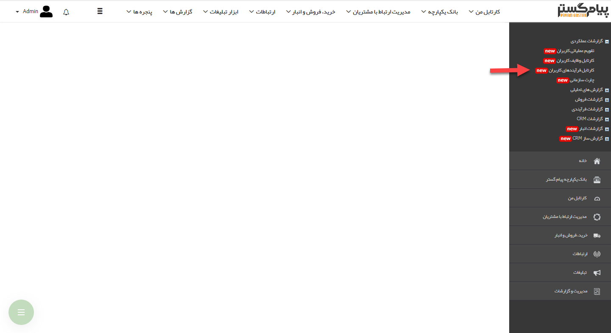
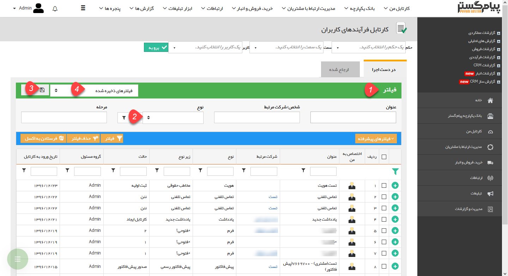

## کارتابل فرآیند های کاربران

در این قسمت مدیر هر واحد می تواند، کارتابل فرآیندهای کاربران زیرمجموعه خود را مشاهده نماید. پس از انتخاب حکم خود، سمت و نام کاربر مورد نظر، فرآیندهای در حال اجرای آن کاربر را می توانید مشاهده نمایید. با استفاده از منوی فیلتر می توان جستجوی دقیقتری از فرآیندهای کاربر مورد نظر داشت. طبق شکل (ترتیب شماره های مشخص شده) در صورتی که قصد ذخیره فیلتر مورد نظر خود را داریم، کافی است پس از انتخاب فیلدهای جستجو در مرحله 2، دکمه ذخیره را زده(3) و سپس، در منوی باز شده، به جستجوی خود یک نام اختصاص دهیم. از این پس با استفاده از منوی فیلترهای ذخیره شده می توان همان تنظیمات جستجو را فراخوانی کرد(4).

> نکته: تنظیمات واحدها، سمت ها و حکم های پرسنلی از قبل باید در  [مدیریت شعب،دپارتمان و سمت](https://github.com/1stco/PayamGostarDocs/blob/master/help%202.5.4/Basic-Information/branches-department/branches-department.md) و[  مدیریت حکم های پرسنلی ](https://github.com/1stco/PayamGostarDocs/blob/master/help%202.5.4/Settings/Personnel-command-management/Personnel-command-management.md)انجام شود.

