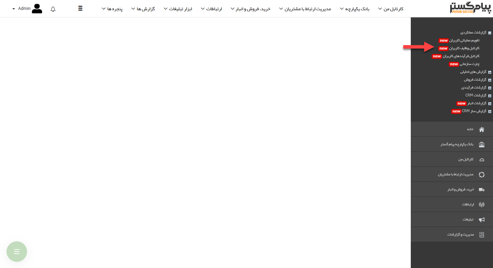
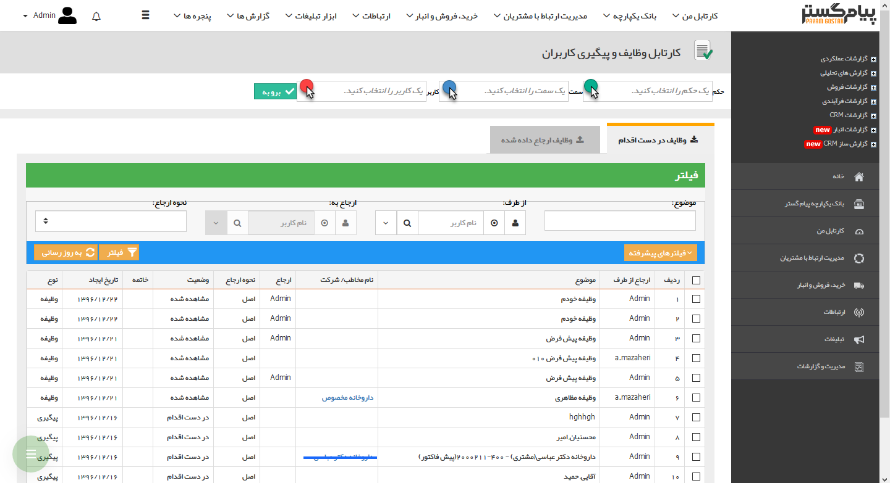

## کارتابل وظایف کاربران

در این قسمت با توجه به حکم خود و سمت و نام کاربر مورد نظر می توانید کارتابل وظایف همان کاربر را مشاهده فرمایید. در این نوع از گزارش گیری، بصورت پیش فرض کارتابل وظایف شخصی که در حال گزارش گیری است، نمایش داده می شود. دکمه فیلترهای پیشرفته می تواند شما را در جستجوی بهتر یاری نماید. با کلیلک بر روی آن، فیلدهای وضعیت وظیفه، نحوه خاتمه و نام مخاطب قابل جستجو می باشد. فیلد نوع می تواند با توجه به نوع آیتم (پیگیری و یا وظیفه) جستجو را محدود نماید.

> نکته:  تنظیمات واحدها، سمت ها و حکم های پرسنلی از قبل باید در  مدیریت شعب،دپارتمان و سمت  و  مدیریت حکم های پرسنلی انجام شود.

