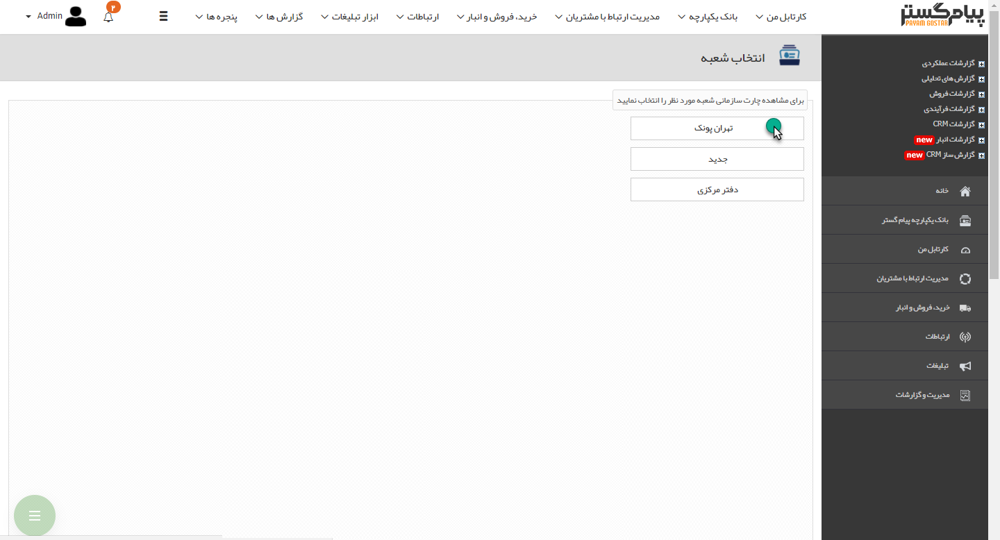
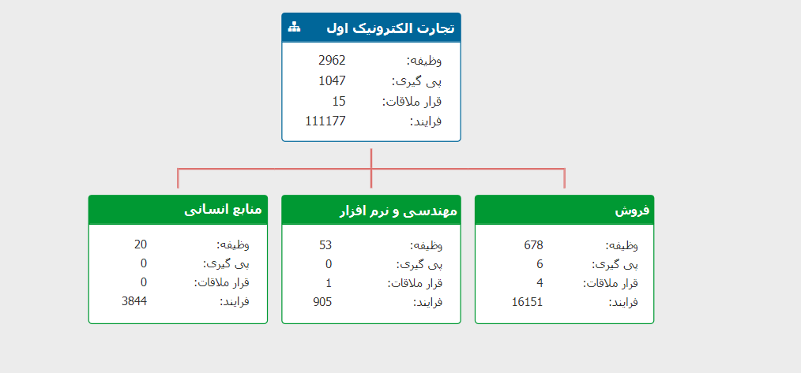

## چارت سازمانی

>  مسیر دسترسی:  **مدیریت و گزارشات** >**گزارشات عملکردی** > **چارت سازمانی** 

تنظیمات و ویرایش چارت سازمانی از طریق منوی[ مدیریت شعب،دپارتمان و سمت](https://github.com/1stco/PayamGostarDocs/blob/master/help%202.5.4/Basic-Information/branches-department/branches-department.md) صورت میگیرد و بصورت یک چارت در این گزارش قابل مشاهده خواهد بود. تعداد وظایف، پیگیری ها،

  قرارملاقات ها وفرآیندها بصورت مجموع برای هر دپارتمان مشخص میگردد.
  
  > نکته: توجه داشته باشید که آیتم های (وظیفه، فرایند و ...) موجود در کارتابل کاربرانی که به آن ها حکم سازمانی تخصیص نداده باشید در محاسبات این گزارش لحاظ نخواهند شد.
  
  > نکته : برای دریافت این گزارش بایستی مجوز مدیریت شعب و دفاتر را داشته باشید.

