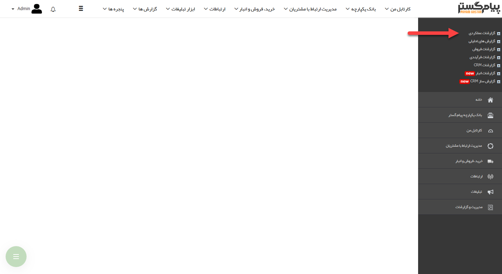

## گزارشات عملکردی

در این قسمت می توانید گزارشات مرتبط با عملکرد کاربران نرم افزار را مشاهده کنید.

توجه داشته باشید دریافت گزارشات عملکردی هر کاربر منوط به داشتن حکم پرسنلی مربوطه می باشد. به طور مثال برای دریافت گزارش عملکرد یک کارشناس فروش باید حکم مدیر فروش یا حکمی با سطح بالاتر از آن را داشته باشید. همچنین باید به کاربر مربوطه نیز ابتدا حکم تخصیص داده شده باشد. 

> نکته: برای دریافت گزارش چارت سازمانی، باید مجوز "مدیریت شعب و دفاتر" داشته باشید.    

[تقویم عملیاتی کاربران](https://github.com/1stco/PayamGostarDocs/blob/master/help%202.5.4/Management-and-reports/Functional-reports/User-Operating-Calendar/User-Operating-Calendar.md)

[کارتابل وظایف کاربران](https://github.com/1stco/PayamGostarDocs/blob/master/help%202.5.4/Management-and-reports/Functional-reports/Cardboard-user-tasks/Cardboard-user-tasks.md)

[کارتابل فرآیندهای کاربران](https://github.com/1stco/PayamGostarDocs/blob/master/help%202.5.4/Management-and-reports/Functional-reports/Cardboard-user-processes/Cardboard-user-processes.md)

[چارت سازمانی](https://github.com/1stco/PayamGostarDocs/blob/master/help%202.5.4/Management-and-reports/Functional-reports/Chart/Chart.md)

