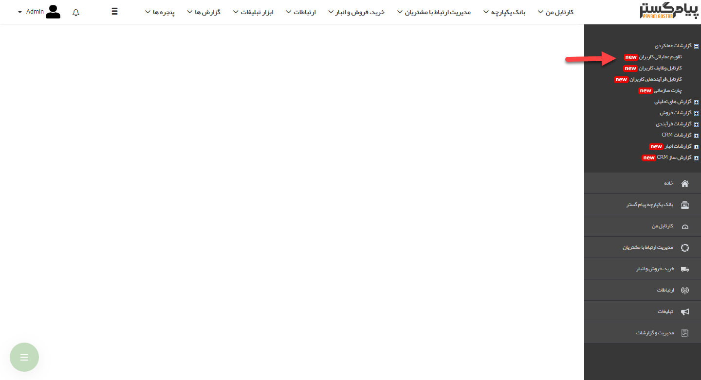
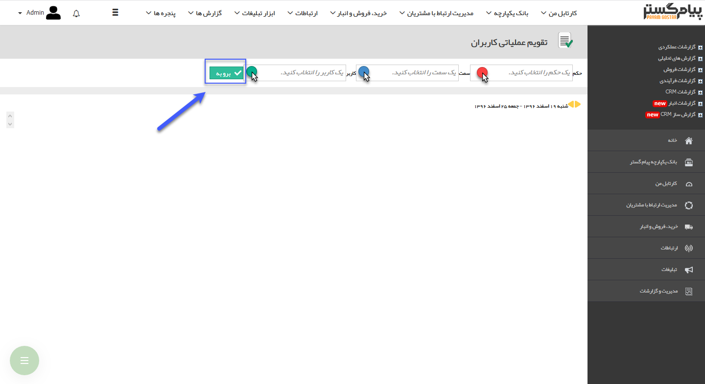

## تقویم عملیاتی کاربران

در این قسمت، مدیر هر واحد با توجه به سمت و حکمی که به وی داده شده، امکان مشاهده عملیات اجرا شده از سوی کاربران واحد خود را دارد. ابتدا شما باید حکم خود و سپس سمت و کاربری که قصد دریافت گزارش از وی دارید را انتخاب نمایید. در انتها روی دکمه "برو به" کلیک کنید تا تقویم عملیاتی کاربر مربوطه را مشاهده نمایید.

> نکته:  تنظیمات واحدها، سمت ها و حکم های پرسنلی از قبل باید در  مدیریت شعب،دپارتمان و سمت  و  مدیریت حکم های پرسنلی انجام شود.

> نکته : تمامی سوابقی که کاربر ایجاد و یا ویرایش می کنند در این قسمت نمایان می شوند. در واقع لیست عملیات اجرا شده توسط کاربر بر روی آیتم های crm قابل مشاهده است .

