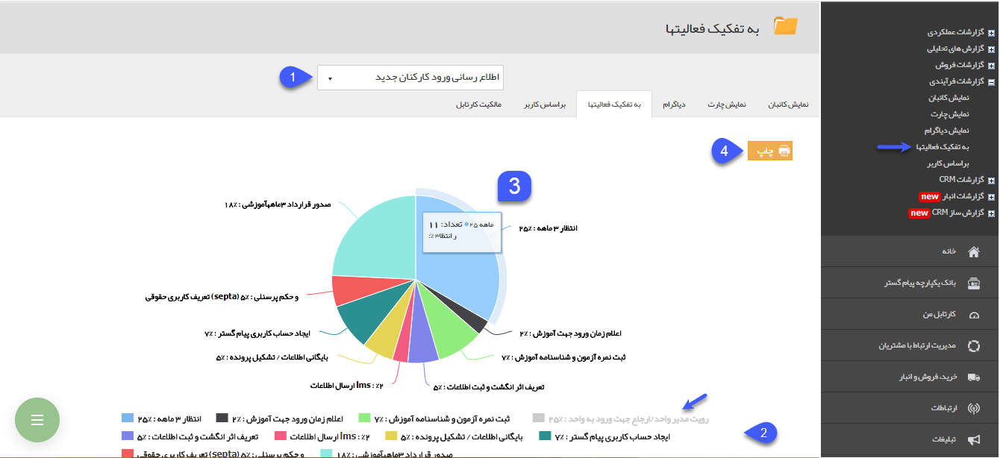
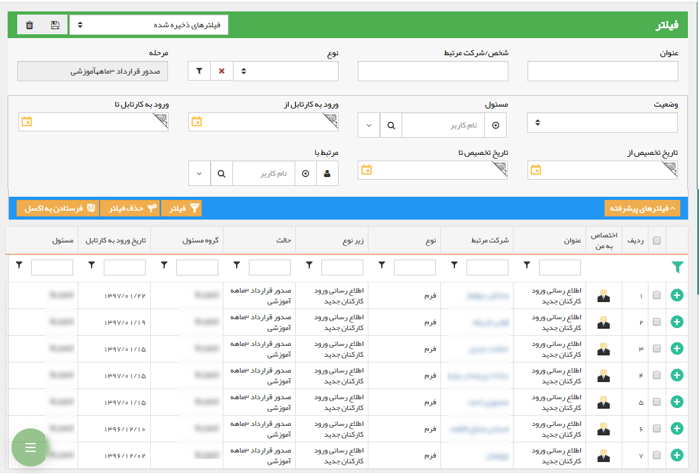

## به تفکیک فعالیت ها

با استفاده از این قسمت می توانید نمودار دایره ای برای مقایسه درصد و تعداد آیتم هایی که در هر مرحله (کارتابل ها و انتظارها) از گردش کار قرار دارند را مشاهده کنید. 

> نکته : برای مشاهده این گزارش کاربر باید مدیر سیستم و یا مدیر ارتباط با مشتری باشد .  

1. انتخاب فرآیند: آیتمی که قصد مشاهده دیاگرام گردش کار مربوط به آن را دارید انتخاب کنید. توجه داشته باشید که در این قسمت تنها می توانید آیتم هایی را انتخاب کنید که چرخه کاری فعال داشته باشند.

2. رنگ هر مرحله (کارتابل یا انتظار) از گردش کار که سابقه در جریان داشته باشد نمایش داده می شود و با کلیک بر روی آن می توانید نمایش آن در نمودار را فعال و غیر فعال کنید.

 
3. با اشاره بر روی هر مرحله از گردش کار، نام مرحله گردش کار، تعداد و درصد آیتم هایی که در آن مرحله قرار گرفته اند را نمایش می دهد. 

> نکته: همچنین با کلیک بر روی هر یک از قسمت های این نمودار می توان آیتم هایی که در آن مرحله قرار گرفته اند را مشاهده کنید. علاوه بر این می توانید در آن قسمت با استفاده از فیلترهای موجود آیتم های مورد نظر خود را بیابید؛ یا از آن ها خروجی اکسل تهیه کنید

4. چاپ: با کلیک بر روی این دکمه می توانید از دیاگرام نمایش داده شده، چاپ بگیرید.

