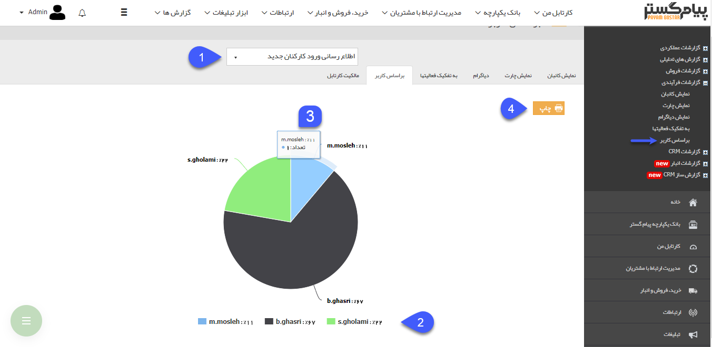

## براساس کاربر

> مسیر دسترسی:  **مدیریت و گزارشات** >**گزارشات فرآیندی** > **براساس کاربر** 

در این قسمت می توانید تعداد آیتم های گردش کار را بر اساس کاربران مالک کارتابل ها مشاهده و بررسی نمایید. در واقع با استفاده از این گزارش می توانید بررسی کنید که سوابق در جریان هریک از فرایندهای پیاده سازی شده بیشتر تحت مالکیت کدام کاربران هستند و میزان پراکندگی سوابق در جریان در کارتابل کاربران مختلف را تحلیل و بررسی کنید.

> نکته : برای مشاهده این گزارش کاربر باید مدیر سیستم و یا مدیر ارتباط با مشتری باشد .

1. انتخاب فرآیند: آیتمی که قصد مشاهده دیاگرام گردش کار مربوط به آن را دارید انتخاب کنید.توجه داشته باشید که در این قسمت تنها می توانید آیتم هایی را انتخاب کنید که چرخه کاری فعال داشته باشند.

2. نام کاربر و درصد آیتم هایی که اکنون در کارتابل آن کاربر هستند را نمایش می دهد و با کلیک بر روی هرکدام می توانید نمایش آن در نمودار را غیرفعال کنید. 

3. با اشاره بر روی هر قسمت از نمودار نام کاربر، تعداد و درصد آیتم هایی که در کارتابل آن کاربر موجود است را می توانید مشاهده کنید.

4. چاپ: با کلیک بر روی این دکمه می توانید از نمودار نمایش داده شده، چاپ بگیرید.