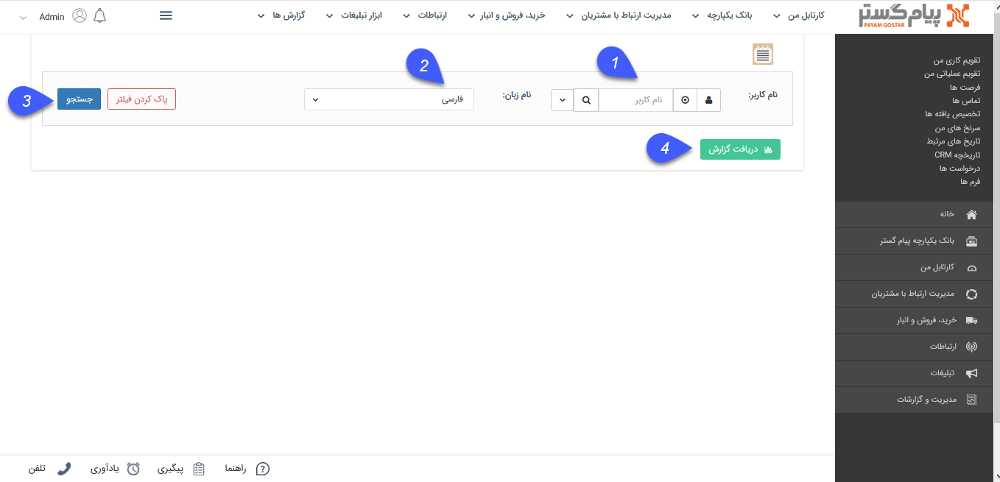
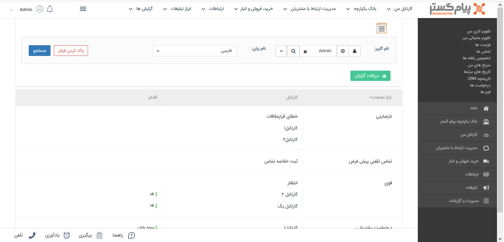

##  گزارش شرح شغل

> مسیر دسترسی:  **مدیریت و گزارشات** >**گزارشات فرآیندی** > **گزارش شرح شغل** 

با استفاده از  این گزارش می  توان وظایفی که بر روی آیتم های  تحت چرخه برای کاربر مشخص شده (کاربر بعنوان مسئول مراحلی از آن فرآیند است) مشاهده  نمود .

در این گزارش  آیتم های تحت چرخه که کاربر مورد نظر بعنوان مسئول در آن چرخه  انتخاب شده نمایش داده می شود .

> نکته : مدیر سیستم و مدیر ارتباط با مشتری  امکان مشاهده شرح شغل همه کاربران را دارند

1. نام کاربر :  انتخاب کاربر مورد نظر برای مشاهده گزارش .

2. نام زبان :  انتخاب زبان مورد نظر  (زبان های تعریف شده در مدیریت زبان ها ) برای مشاهده گزارش .

3. جستجو :  مشاهده گزارش

4. دریافت گزارش :  امکان دریافت خروجی html  از گزارش تهیه شده .

در ستون اول نام آیتم تحت چرخه ،  در ستون دوم  مراحلی که کاربر بعنوان  مسئول انتخاب شده و در ستون سوم اقدام هایی که در آن مرحله  کاربر مشاهده می کند ، نمایش داده می شود .

> نکته مورد نظر این است که در گزارش از شرح شغل هر کاربر می تواند شرح شغل خود را مشاهده کند

