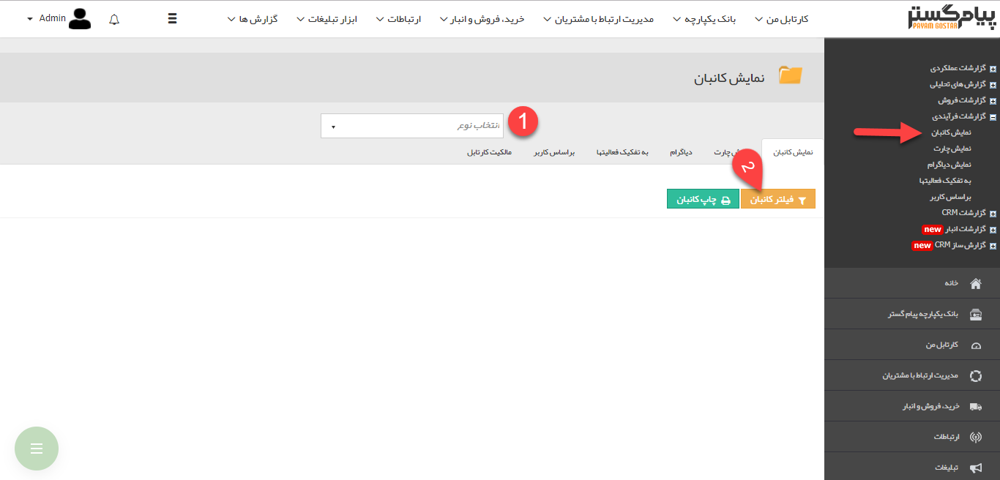
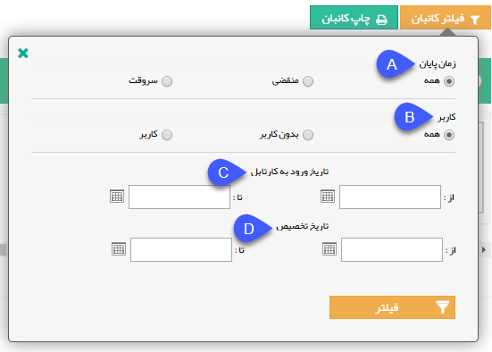
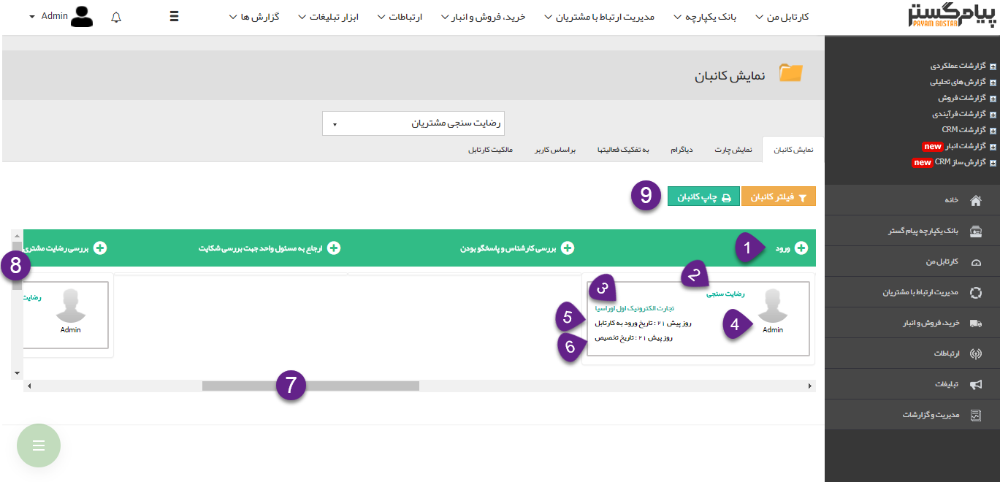

## نمایش کانبان

در این قسمت می توانید نمای کانبان هر یک از چرخه های کاری فعال در نرم افزار را مشاهده کنید. در واقع با استفاده از این گزارش می توانید مشاهده کنید سوابق در جریان هر یک از فرآیندهای پیاده سازی شده را مورد بررسی قرار دهید و مشاهده کنید که در هر یک از کارتابل ها و انتظارهای این فرایندها، چه سوابق در جریانی قرار دارد و این سوابق تحت مالکیت کدام کاربران هستند.

> نکته : برای مشاهده این گزارش کاربر باید مدیر سیستم و یا مدیر ارتباط با مشتری باشد .

1. انتخاب فرآیند: نوع و نام آیتمی که بر روی آن، گردش کار قرار گرفته است را انتخاب کنید. توجه داشته باشید که در این قسمت تنها می توانید آیتم هایی را انتخاب کنید که چرخه کاری فعال داشته باشند.

2. فیلترهای کانبان: می توانید نمای کانبان را بر اساس فیلدهای زیر فیلتر کنید.

A. زمان پایان: می توانید تعیین کنید که همه آیتم های تحت فرآیند، آنهایی که زمان پایان کارتابل آنها فرا رسیده است و یا آنهایی زمان پایان آنها فرا نرسیده است، نمایش داده شود.

B. کاربر: می توانید همه آیتم ها، آنهایی که کاربر مسئول ندارند و یا آنهایی که در کارتابل یک کاربر به خصوص هستند را فیلتر کنید. ( انتظارها و کارتابل هایی که مسئول آن ها گروهی از کاربران هستند و هنوز به کاربر مشخصی تخصیص داده نشده اند در این گزارش به صورت بدون کاربر نمایش داده می شوند)

C. تاریخ ورود به کارتابل: بازه زمانی تاریخ ورود به کارتابل را برای آیتم تحت گردش کار می توانید تعیین کنید.

D. تاریخ تخصیص: بازه زمانی تاریخ تخصیص آیتم تحت گردش کار را می توانید تعیین کنید.

1. عنوان کارتابل: عنوان مرحله ی گردش کار که آیتم در آن قرار گرفته است را نمایش می دهد. (این مرحله می تواند یکی از کارتابل ها یا فعالیت های انتظار باشد)

2. عنوان آیتم: عنوان آیتم را نمایش می دهد و با کلیک بر روی آن می توانید آیتم مورد نظر را مشاهده کنید.

3. نام هویت: نام هویتی که مرتبط با این آیتم است را نمایش می دهد و با کلیک بر روی آن می توانید پروفایل هویت را مشاهده کنید.

4. نام کاربر: در این قسمت نام کاربری که در حال حاضر این آیتم در کارتابل وی قرار دارد را نمایش می دهد.

5. تاریخ ورود به کارتابل: تاریخی که در آن فرآیند مرتبط با این آیتم آغاز شده است را نمایش می دهد.

6. تاریخ تخصیص: تاریخ تخصیص به کاربر را نمایش می دهد. (توجه کنید کارتابل هایی که مسئول آن ها گروهی از کاربران است، تا زمانی که به یکی از کاربران آن گروه تخصیص پیدا نکنند، فیلد تاریخ تخصیص آن ها بدون مقدار نمایش داده می شود)

7. نشانگر چپ و راست: جهت مشاهده سایر کارتابل ها و انتظارها باید از این نشانگر استفاده شود.

8. نشانگر بالا و پایین: جهت مشاهده تمام آیتم های موجود در یک کارتابل(یا انتظار) خاص با استفاده از این نشانگر می توان، صفحه را بالا و پایین کرد.

9. چاپ: جهت چاپ کلی گزارش می توان از این دکمه استفاده نمود .