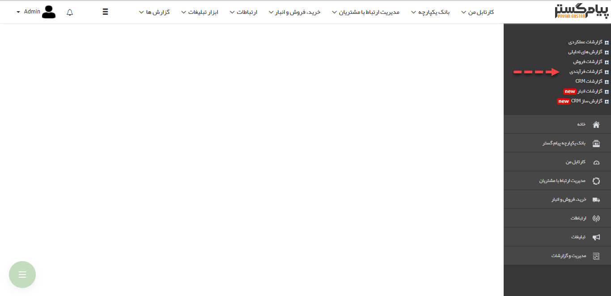

## گزارشات فرآیندی

با استفاده از گزارشات فرآیندی میتوانید نحوه عملکرد فرآیندهای پیاده سازی شده روی آیتم های مختلف نرم افزار را مورد بررسی قرار دهید و گلوگاه های فرایندهای خود را بشناسید. یعنی بدانید که فرآیندهای در جریان، بیشتر در کدام کارتابل ها و تحت مالکیت کدام کاربران هستند.

[نمایش کانبان](Kanban-Show%2FKanban-Show.md)

[نمایش چارت](Chart-Show%2FChart-Show.md)

[نمایش دیاگرام](View-diagram%2FView-diagram.md)

[به تفکیک فعالیتها](Activities-separately%2FActivities-separately.md)

[بر اساس کاربر](Based-%20user%2FBased-%20user.md)

[گزارش شرح شغل](Job-Description-Report%2FJob-Description-Report.md)