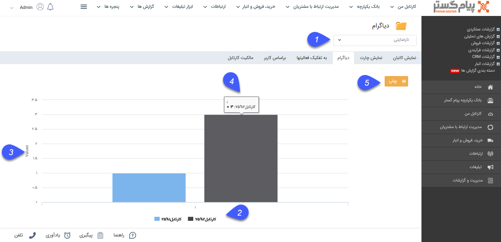
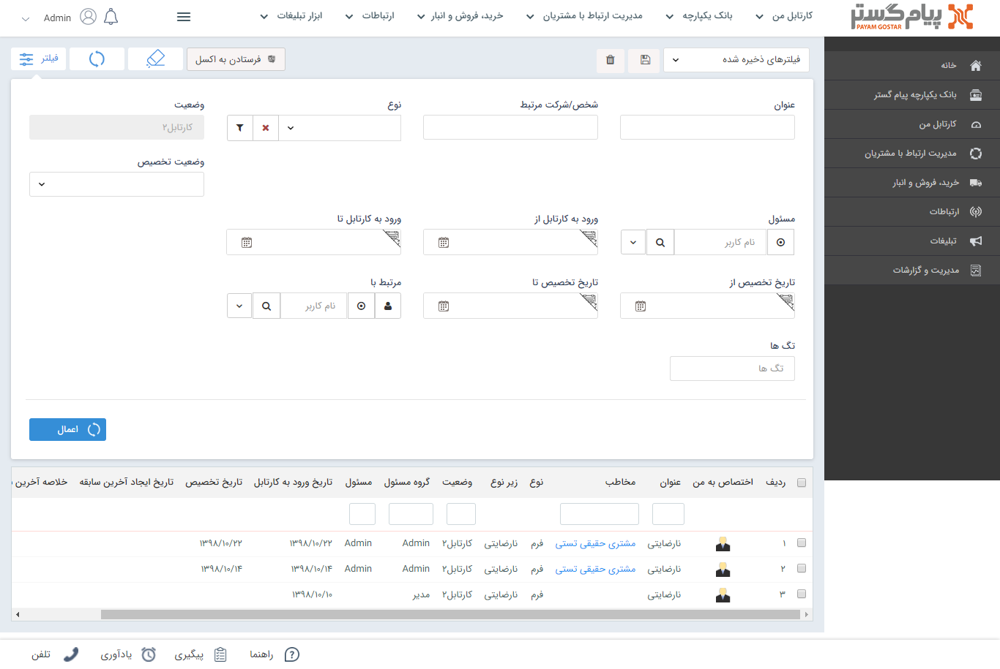

## نمایش دیاگرام

با استفاده از این قسمت می توانید پراکندگی مراحلی از گردش کار (کارتابل ها و انتظارها) که آیتم در آن قرار دارد را مشاهده کنید. ( می توان مشاهده کرد از این آیتم چه تعداد سابقه در چه مرحله ای قرار دارد )

توجه کنید کارتابل ها و انتظارها (مراحلی) که در حال حاضر هیچ سابقه در جریانی ندارند در این دیاگرام نمایش داده نمی شوند.

> نکته :برای مشاهده این گزارش کاربر باید مدیر سیستم و یا مدیر ارتباط با مشتری باشد .

1. انتخاب فرآیند: آیتمی که قصد مشاهده دیاگرام گردش کار مربوط به آن را دارید انتخاب کنید. توجه داشته باشید که در این قسمت تنها می توانید آیتم هایی را انتخاب کنید که چرخه کاری فعال داشته باشند.

2. رنگ هر مرحله (کارتابل یا انتظار) از گردش کار که سابقه در جریان داشته باشد نمایش داده می شود و با کلیک بر روی آن می توانید نمایش آن در دیاگرام را فعال و غیر فعال کنید.

Values3 . داد آیتم هایی که در هر مرحله هستند را نمایش می دهد.

4. با اشاره بر روی هر مرحله از گردش کار، نام مرحله گردش کار، تعداد و درصد آیتم هایی که در آن مرحله قرار گرفته اند را نمایش می دهد.

> نکته: همچنین می توانید با کلیک بر روی هر یک از ستونها پنجره آیتم هایی که در آن مرحله قرار گرفته اند را مشاهده کنید. علاوه بر این می توانید با استفاده از فیلترهای موجود در این قسمت آیتم های مورد نظر خود را بیابید؛ یا از آن ها خروجی اکسل تهیه کنید.

5. چاپ: با کلیک بر روی این دکمه می توانید از دیاگرام نمایش داده شده، چاپ بگیرید.

