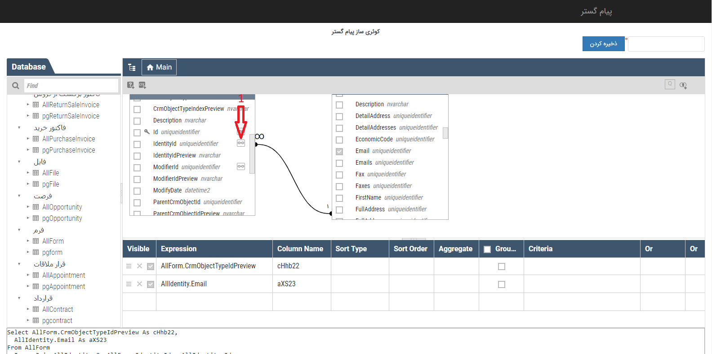

## گزارش ساز جدید

سند پیش رو در بردارنده شرح و توضیح موتور گزارش سازی است که به صورت Plug in در گزارش ساز نرم افزارCRM مورد استفاده قرار گرفته است. برای استفاده از این امکان لازم است مهارت های زیر را در سطح گزارش های مدنظر خود کسب کنید:

- درک مناسبی از مدل های داده ای مورد استفاده و ارتباط داده ای: به طور مثال باید بدانیم که در گزارش مد نظر به چه اطلاعاتی از "فرصت" های ثبت شده در سیستم نیاز داریم و همچنین در صورتیکه به داده های "هویت" های مرتبط این فرصت ها نیز نیاز داریم، باید بدانیم که داده های مربوط به فرصت ها و هویت ها در دو جدول مختلف نگهداری می شوند و با یک خصوصیت مشترک (کلید) به هم متصل می شوند. به این ترتیب و با تعمیم این دیدگاه می توان یک پایگاه داده رابطه ای (Relational ) را متصور شد که همه جداول آن با کلید های متعدد به هم در ارتباط هستند.

-         آشنایی ابتدایی با زبان RDL (Report Definition Language) : در واقع Plug in یاد شده با استفاده از این زبان داده ها را از منابع داده ای در دسترسی انتخاب کرده و در خروجی گزارش در اختیارشما قرار می دهد. این Plug in محیط نوشتار و ویرایشگری این دستورات این زبان را در اختیار قرار می دهد.

### شروع کار با گزارش ساز

برای آغاز به کار با گزارش ساز باید قبل از هر اقدامی مشخص کنید که قصد دریافت گزارش از چه داده هایی را دارید. در اصطلاح باید Date Set مورد نظر خود را مشخص کنید. [1]

شما می توانید با انتخاب دکمه "مدیریت گزارش ها" و  سپس با "ایجاد گزارش جدید" در لیست همه ی آیتم های ( موجودیت ها)  اقدام به ایجاد گزارش جدید کنید.

نکته :  برای دریافت این گزارش کاربر بایستی مجوز مشاهده گزارش های ساخته شده را داشته باشد.

در صورت دارا بودن ماژول گزارش ساز پیشرفته، امکان افزودن این گزارش به گزارش های ساخته شده قبلی از طریق دکمه "افزودن به" وجود دارد.

ایجاد گزارش جدید

برای ایجاد گزارش جدید از آیتم مورد نظر بایستی در لیست آن آیتم روی گزینه ایجاد گزارش کلیک کنید. اگر میخواهید براساس پارامتر یا پارامتر های خاصی این گزارش را بسازید میتوان ابتدا براساس پارامتر های مد نظرتان این لیست را فیلتر کنید و سپس روی گزینه ایجاد گزارش کلیک کنید که این راه یک راه برای فیلتر دیتاهای گزارش مورد نظرتان است.

با کلیک بر روی ایجاد گزارش مراحل ایجاد گزارش آغاز می شود .

A.افزودن هویت های مرتبط : برای ساخت گزارش جدید در گام اول، امکان افزودن فیلد های، هویت های مرتبط با آیتم در اختیار کاربر قرار میگیرد و به این ترتیب کاربر می تواند این داده ها را نیز به مجموعه داده های مورد نظر برای دریافت گزارش بیفزاید.

به عنوان مثال شما میتوانید با استفاده از این امکان،شماره موبایل هویت مرتبط با آیتم مورد نظر را در گزارش داشته باشید.

B . افزودن منابع : در صورت دارا بودن ماژول گزارش ساز پیشرفته با استفاده از این کلید، این امکان به کاربر داده شده است که از منابع مختلفی برای تهیه گزارش مورد نظر استفاده کرد که پیش تر در رابطه با این موارد توضیح داده خواهد شد .

C. آدرس سرویس:  در صورت دارا بودن ماژول گزارش ساز پیشرفته و همچنین سازمانی بودن نسخه نرم افزار، میتوان با کپی کردن این آدرس و جایگذاری در powerBi، از دیتای این گزارش در نرم افزار PowerBi استفاده کرد.

نکته : در نسخه استاندارد امکان استفاده از powerBi وجود ندارد.

D.ویرایش : با استفاده از این قسمت می توان دیتا سورس انتخاب شده برای گزارش گیری را ویرایش کرد و آیتم دیگری را برای گزارش مورد نظر انتخاب کرد .

1.بانک اطلاعاتی پیامگستر : از منابع پیامگستر زمانی استفاده می شود که بخواهیم علاوه بر موجودیتی که در حال گزارش گیری آن هستیم از موجودیت های دیگری در این گزارش استفاده کنیم.

در این بخش امکان انتخاب موجودیت های اصلی(مثلا تمام فرم ها)  و یا زیر نوع تعریف شده برای موجودیت (مثلا فرم مرخصی )  را فراهم می کند. در اصل در این قسمت  فیلد های مورد نیاز از هر موجودیت انتخاب میشود تا در مرحله بعد برای گزارش گیری مورد استفاده قرار گیرد.

>  نکته : در این قسمت موجودیت ها و فیلد هایی نمایش داده می شود که کلید کاربر برای آنها در شخصی سازی CRM تعریف شده باشد و همچنین با استفاده از منابع بانک اطلاعاتی پیام گسترعلاوه بر موجودیت های پیامگستر  می توان از لیست محصولات ، محصولات  و همچنین اتاق ها گزارش داشت.

از منویdatabase، موجودیت(های) مورد نظر خود را انتخاب کنید ، لیست فیلد های آن در منو Mainبصورت جدول، نمایش داده می شود . می توان تمام فیلد ها و یا فیلد هایی که برای گزارش نیاز است را از این بخش انتخاب نمود . 

در انتخاب فیلد موجودیت ها، فیلد هایی که از جنس هویت هستند(مانند مرتبط با (identityid) و یا ایجاد کننده آیتم (creatorid) و  ...  ) اگر بخواهیم فیلد خاصی از اون هویت رو در این منبع داشته باشیم تا در گزارش استفاده کنیم،می توانیم با باز کردن ویژگی های اون فیلد  (1) اطلاعاتی که از اون هویت نیاز است را انتخاب و به آن موجودیت متصل کنیم، در گزارش داشته باشیم انتخاب کنیم .

  برای مثال می خواهیم  طبق تصویر، ایمیل هویت مرتبط با این فرم رو در گزارش  داشته باشیم از این روش استفاده می کنیم.
  
  
  
  visible : از این بخش امکان انتخاب و یا حذف فیلد های انتخاب شده وجود دارد.

expression : در این قسمت نام فیلد ها نمایش داده میشود و  اسم آن موجودیت را به صورت پیشوند به فیلد ها  اضافه می کند تا مشخص شود هر فیلد از کدام آیتم انتخاب شده است .

column Name : اسم مربوط به هر فیلد که در مرحله بعد  برای گزارش گیری نمایش داده می شود

sort type : میتوانید المانی را برای مرتب سازی فیلد ها انتخاب کنید.

criteria:  می توان از این بخش فیلتر های مورد نظر بر روی هر فیلد اعمال کرد ( در این مرحله برای هر فیلد می شود تا سه مرحله فیلتر تعریف کرد، اگر بخواهیم بیش از سه فیلتر استفاده شود باید از طریق کد نویسی در محیط SQL  پایین صفحه استفاده کرد )

اگر کاربر بخواهد از روش پیشرفته تری گزارش داشته باشد می تواند از طریق کد نویسی در محیط   SQL  استفاده کند ، با استفاده از این روش می تواند فیلتر های مشخصی را اعمال و یا براساس المانی فیلد ها را مرتب سازی کند.

هنگام استفاده از این محیط پس از اضافه نمودن تغییرات مورد نظر حتما باید کلید بروز رسانی زده شود ، تا موارد اعمال شده در جدول قرار گیرد .

2.سایر بانکهای اطلاعاتی :  استفاده از این قابلیت، این امکان را به کاربر خواهد داد تابرای ساخت گزارش مدنظر اطلاعات مورد نیاز خود از سایر بانک های اطلاعاتی دیگر به منابع این گزارش اضافه کند.

بعنوان مثال کاربر می تواند از دیتا بیس نرم افزار حسابداری موجودیت های حسابداری مورد نظر رو به پیامگستر متصل کند و گزارشی داخل پیامگستر داشته باشد .

برای نمونه می خواهید گزارشی از دستمزد کاربران داشته باشید، کاربران در پیامگستر و حقوق کاربران در سیستم حسابداری تعریف شده است، با استفاده از این امکان می تواند اطلاعات مورد نظر برای این گزارش را از سیستم حسابداری به این گزارش منتقل کند.

نام :  یک نام برای این منبع بانک اطلاعاتی انتخاب کنید.

آدرس سرور : در این بخش آدرس سرور بانک اطلاعاتی را وارد کنید.

نوع دسترسی:  دسترسی به دیتا بیس  مورد نظر از دو طریق امکان پذیر است :

1. Windows Authentication  :      از طریق user که لاگین است .

2. SQL Server Authentication : از طریق user و پسورد مشخص دیتا بیس .

بانک اطلاعاتی : نام بانک اطلاعاتی مورد نظر  باید وارد شود ، زیرا ممکن است در اون آدرس وارد شده چندین بانک اطلاعاتی وجود داشته باشد .

بررسی اتصال : امکان بررسی صحت اطلاعات ثبت شده

موجودیت های بانک اطلاعاتی دیگر هم مانند منبع بانک اطلاعاتی پیامگستر، نمایش داده می شود که کاربر با توجه به نیاز موجودیت های مورد نظر خود را  برای ایجاد گزارش انتخاب میکند .

3.تاریخ  های شمسی :   

با استفاده از اضافه کردن بانک تاریخ های شمسی می توان نحوه نمابش فیلد های تاریخی موجود در گزارش را مشخص کرد.

بعنوان مثال میتوان نحوه نمایش تاریخ ایجاد آیتم را مشخص کرد که چندمین روز از سال شمسی است .

4. فایل اکسل :

با استفاده از این قابلیت  این امکان فراهم می شود تا فایل اکسلی به عنوان منبع به گزارش اضافه شود  .

بعنوان مثال کاربر برای تهیه گزارش خود به اطلاعات موجود در فایل اکسلی نیاز دارد، با استفاده از این قابلیت این امکان فراهم می گردد که فایل اکسل مورد نظر را به گزارش اضافه کند.

نام :  یک نام برای این بانک اطلاعاتی در نظر بگیرید.

اتصال فایل اکسل به گزارش از سه طریق قابل انجام است

1)  انتخاب فایل اکسل بصورت مستقیم

2)  انتخاب مسیر فایل اکسل زمانی که در شبکه بار گذاری شده است

3)  از طریق آدرس url

اولین ردیف فایل اکسل، به عنوان سر ستون انتخاب میشود، سر ستون ها بعنوان فیلدهای مورد نظر برای گزارش در نظر گرفته می شود .

> نکته :  درگزارش گیری از فایل اکسل، اطلاعات موجود در فایل اکسل در همان لحظه گزارش داده میشود، نه زمانی که فایل اکسل به گزارش اضافه شده است.

پس از انتخاب منابع مورد نیاز  با دکمه "بعدی" وارد گام دوم از ساخت گزارش میشوید :

شما  با کلیک کردن بر روی تب(1) Data میتوانید منابع داده ای اضافه شده به این گزارش را مشاهده کنید.

محیطی که در اختیار دارید محیط طراحی گزارش می باشد و امکانات زیر را در اختیار خواهید داشت:

برای فعال سازی Header   و  Footer به گزارش، می توان از آیکون های زیر استفاده نمود:

  برای ایجاد یک نمونه گزارش  لیستی از ToolBox   بخش  DataRegions میتوان یک  grid به صفحه اضافه کرد.
  
  
  
  برای پر کردن grid که به صفحه افزوده اید،  باید روی تب Properties(1)  کلیک کرده  سپس از منوی باز شده روی بخش Data(2)  کلیک کنید

در بخش Data، داده های مربوط به موجودیتی که روی آن اقدام به گزارش سازی کرده ایم، نمایش داده می شود و یا می توان از (1) منابع اضافه شده به گزارش را برای تهیه گزارش انتخاب نمود. برای برقراری ارتباط بین منبع های افزوده شده جلوتر توضیح داده خواهد شد .

 این داده ها در دو بخش زیر نمایش داده می شوند: 

1.Measures

در این گروه تمام فیلد هایی که ماهیت عدد و پول داشته باشند نمایش داده می شوند.

2.Dimensions

در این گروه تمام فیلد هایی با ماهیت غیر عددی نمایش داده می شوند.

قابل ذکر است که داده های مربوط به هویت ها در این مرحله در دسترس نیستند و در بخش Expression در دسترس قرار خواهند گرفت. این بخش توضیح داده خواهد شد.

تنها فیلد های اضافه ای که دارای کلید کاربر می باشند در داده های قابل گزارش گیری قابل مشاهده و استفاده می باشند.

> . نکته: برخی فیلد ها به دو صورت قابل استفاده اند:

 استفاده از مقدار آنها و یا مقدار نمایشی آنها . بنابراین برای تمایز بین این مقادیر کلمه preview به انتهای فیلد نمایشی اضافه شده است.

مثال: فیلد های IdentityId وIdentityIdPreview  در مورد هویت ها ، در ادامه از فیلد  IdentityPreview زمانی استفاده میکنیم که بخواهیم نام هویت مرتبط با آیتم جاری را نمایش دهیم. 

 

لازم به ذکر است ، زمانی فیلد Identity   مورد استفاده قرار می گیرد که قصد ایجاد ارتباط بین هویت ها و سایر  آیتم ها را داشته باشیم. به این ترتیب این فیلد تحت عنوان یک کلید مورد استفاده است.

در ادامه چگونگی برقراری این ارتباط را در استفاده از بخش Expression توضیح داده خواهد شد.

  یک مثال:

فرض کنید قصد داریم رنگ هویت های مرتبط با لیست موجودیت انتخاب شده را در گزارش به عنوان خروجی دریافت کنیم.

برای اینکه مشخص کنیم چه ستون های داده ای قرار است در گزارش نمایش داده شوند و یا از کدام ستون ها برای نوشتن از  عبارات RDL استفاده خواهیم کرد، ستون های مد نظر را به بخش Column می افزاییم.

به این ترتیب در این مثال ستون IdentityId و سایر ستون هایی که در عکس مشاهده می کنید را  در بخش Column قرار می دهیم.

برای دسترسی به داده های هویت و همچنین برقراری ارتباط و در دسترس قرار دادن داده های ترکیبی، باید از نوشتن عبارات RDL استفاده کنیم. برای این کار، روی چرخ دنده کنار فیلد کلیک کرده و روی گزینه Experssion  کلیک می کنیم. 

با کلیک روی گزینه Expression، فرم زیر را در اختیار خواهیم داشت:

در قسمت اول در بالای صفحه (3)، می توان دستورات RDL را وارد کرد .

در قسمت Data، امکان انتخاب دیتاهای مورد نظر را در اختیار کاربر قرار میگذارد، در بخش 1 امکان انتخاب نوع موجودیت و از بخش 2 امکان انتخاب فیلد های آن موجودیت وجود دارد، در این مثال این داده ها مربوط به هویت(1) می باشند. به این ترتیب تمام فیلد های هویت در بخش (2) در اختیار قرار می گیرند.

ذکر دو نکته الزامی است:

1. با وجود اینکه IdentityId از فیلد های هویت می باشد، در لیست داده های اولیه در اختیار بود. این به این دلیل است که این فیلد یک کلید برای ارتباط می باشد. بنابراین می دانیم که در مدل های ارتباطی، ستون هایی که کلید هستند، در داده های اولیه مربوط به لیستی که روی آن اقدام به گزارش سازی کرده ایم موجود می باشند.

2. کلیه منابع داده های افزوده شده به گزارش، در پنجره Expression و در بخش Data برای استفاده در اختیار قرار دارند.

 

برای دریافت رنگ همه هویت های مرتبط با آیتم های لیست اولیه، می توان از نوشتن عبارت زیر در بخش Set Expression For Column استفاده کرد:

=LookUp (Fields!IdentityId.Value, Fields!Id.Value, Fields!ColorIdPreview.Value, “همه_هویت_ها”)

این عبارت یک LookUp می سازد. LookUp در واقع یک لیست از داده هایی است که طبق شرایط خاصی ساخته شده و در اختیار قرار می گیرد. قسمت اول، دوم و چهارم این عبارت همیشه ثابت است. و تنها قسمت سوم پرانتز می باشد که به فراخور نیاز در بردارنده ستون های مختلفی از هویت می باشد.

این عبارت هویت هایی که ستون Id آنها با ستون IdentityId آیتم های لیست اولیه برابر است را پیدا کرده و مقدار رنگ آنها را بازگردانده و در یک لیست قرار می دهد و این لیست را به عنوان یک lookup در اختیار قرار می دهد.

Data: لیست تمامی منابع گزارش از این بخش قابل مشاهده است.

Parameters  :  با استفاده از کلید new parameter میتوان پارامتر جدیدی را برای فیلتر گزارش و یا مرتب سازی گزارش استفاده کرد. نحوه استفاده از این پارامتر برای فیلتر و مرتب سازی گزارش جلوتر توضیح داده خواهد شد.

Name :  نام پارامتر مورد نظر خود را به انگلیسی وارد کنید.

Prompt:  نامی که برای دسترسی به این پارامتر میخواهید تعریف کنید را وارد کنید.

Data type :  نوع پارامتر مورد نظر را انتخاب کنید. ( لازم به ذکر است نوعی که برای پارامتر انتخاب میکنید با نوع فیلدی که میخواهید براساس آن فیلتر و یا مرتب سازی انجام دهید باید یکسان باشد)

Allow blank value  :  اگر میخواهید در صورت خالی بودن پارامتر، جستجو انجام شود میتوانید این چک باکس را فعال کنید.

Allow null value :  اگر میخواهید در صورت null پارامتر جستجو انجام شود، میتوانید این چک باکس را فعال کنید.

Allow multiple values: اگر میخواهید این پارامتر با چند مقدار جستجو انجام دهد می توانید این چک باکس را فعال کنید .

Visibility  : تنظیمات نمایش این پارامتر را میتوانید از این قسمت انجام دهید.

Assign value :  برای اینکه این پارامتر دارای مقادیر مشخص برای فیلتر یا مرتب سازی باشد میتوان از این بخش استفاده کرد.

تعریف فیلتر برای گزارش :

پس از انتخاب فیلد های مورد نظر برای گزارش گیری از تب data، از بخش properties میتوان فیلتر و  یا نحوه مرتب سازی خود را تعریف کنید

Set filters :

با کلیک بر روی دکمه add میتوانید یک فیلتر جدید تعریف کنید.

choose field : فیلدی که میخواهید براساس آن گزارش خود را فیلتر کنید از این بخش انتخاب کنید.

2: از این بخش نوع فیلتر را میتوانید انتخاب کنید

Value : اگر بخواهید تنها فیلتر با مقدار مشخصی اعمال گردد آن مقدار را میتوانید در این بخش وارد کنید.

به عنوان مثال : میخواهید گزارشی از آیتم هایی با تاریخ ایجاد قبل از تاریخ 30 آذر 98 داشته باشید، ابتدا فیلد   create date را از بخش choose field  انتخاب کنید، سپس علامت کمتر را انتخاب کنید و تاریخ مورد نظرتان  را در بخش value  وارد کنید.

reset  :  با reset  میتوان مقدار value  را تعریف شده را حذف کرد.

Expression :     از این بخش میتوان پارامتری که در بخش   Parameters  تعریف شده را برای نمایش این فیلتر انتخاب کرد. در واقع تنظیمات نمایشی فیلتر در بخش Parameters   تعریف میشود و اینکه این فیلتر روی کدام فیلد اعمال شود از بخش choose field انتخاب می گردد.

5.با این کلید می توانید فیلتر مورد نظر خود را حذف کنید .

Set sorts :

با کلیک بر روی دکمه add میتوانید یک نحوه مرتب سازی جدید تعریف کنید.

choose field : فیلدی که میخواهید براساس آن رکور های خود را مرتب کنید از این بخش انتخاب کنید.

reset  :  با reset  میتوان فیلد انتخاب شده را حذف کرد.

Expression :     از این بخش میتوان پارامتری که در بخش   Parameters  تعریف شده است را برای نمایش این  نحوه مرتب سازی انتخاب کرد. در واقع تنظیمات نمایشی این پارامتر در بخش Parameters   تعریف میشود و اینکه این مرتب سازی روی کدام فیلد اعمال شود از بخش choose field انتخاب می گردد.

1. نحوه مرتب سازی(صعودی / نزولی) مشخص کنید .

2. با این کلید می توانید مرتب سازی مورد نظر خود را حذف کنید. 

مشاهده خروجی گزارش

برای مشاهده خروجی گزارش طراحی شده از گزینهPreview  استفاده کنید. قابل ذکر است که در حالت طراحی زمانی که روی دکمه Preview کلیک میکنید فقط 10 رکورد از خروجی مورد نظر را مشاهده خواهید کرد. ولی در زمان اجرای گزارش، خروجی های کامل را در اختیار خواهید داشت.

اعمال تغییرات روی ستون های گریدی که در طراحی به گزارش افزوده شده

بدیهی است که ممکن است قصد ویرایش گرید وارد شده به طراحی گزارش را داشته باشید.

برای اعمال تغییرات کافیست روی  گرید کلیک کرده  در تب Properties  روی گزینه Properties کلیک کنید. به این ترتیب کلیه خصوصیات گرید انتخاب شده را مشاهده خواهید کرد. 

به عنوان مثال  برای تغییر عنوان ستون ها کافیست  در بخش Column Setting ، از گزینه (1) ChooseColumn برای انتخاب ستون مورد نظر و در بخش پایین آن (2) نام مورد نظر را وارد کنیم.

> نکته : در صورت ویرایش ستون های گزارش، ترتیب ستون ها در بخش تنظیمات مربوط به نام نمایش ستون ها (column setting) جابجا شده و باید دوباره مرتب شود.

نکته : در صورت ویرایش ستون های گزارش، ترتیب ستون ها در بخش تنظیمات مربوط به نام نمایش ستون ها (column setting) جابجا شده و باید دوباره مرتب شود.

با کلیک بر روی دکمه ارسال کردن به گام بعدی منتقل می شوید.

گام سوم : ذخیره گزارش

پس از انجام این مراحل و طراحی گزارش مربوطه نام مورد نظر و یک دسته بندی برای ذخیره گزارش انتخاب کنید

> نکته : امکان افزودن دسته بندی جدید  ، تغییر نام و حذف یک دسته بندی از این بخش وجود دارد .

با کلیک بر روی دکمه نهایی گزارش ذخیره می گردد .

ساخت گزارش حساس به زبان سیستم

در نظر داشته باشید که یک گزارش باید به زبان سیستم حساس باشد. به این معنی که اگر گزارشی طراحی می کنید این گزارش در زبان فارسی نمایش متفاوتی از زبان انگلیسی دارد. برای طراحی گزارش به این صورت می توانید به شرح زیر عمل کنید:

شما میتوانید در هر طراحی یک گزارش یکبار آنرا در مود راست به چپ و یکبار آن را مود چپ به راست ذخیره کنید. به این ترتیب طراخی راست به چپ در زبان فارسی و طراحی چپ به راست در زبان انگلیسی در اختیار خواهند 

افزودن سورس داده ای به یک گزارش از پیش ساخته شده

 
در صفحات لیست با کلیک روی دکمه مدیریت گزارش ها  و بعد انتخاب یکی از گزارش های از قبل ساخته شده، این امکان وجود دارد که  این لیست نیز به عنوان یک منبع داده ای به گزارش مورد نظر افزوده شود.  این داده ها در بخش Expression طراحی گزارش و در بخش Date در اختیار قرار می گیرند.

 با استفاده از این قابلیت این امکان فراهم است که منبع های مختلفی در گزارش داشته باشیم و یا ارتباط بین دو منبع را از طریق نوشتن عباراتRDL  فراهم کنیم.

بعنوان نمونه، ما در سوابق فرم، قرارداد ایجاد کرده ایم، در گزارش از قراردادها می خواهیم ویژگی هایی از فرمی که به این قرار داد مرتبط است را نیز داشته باشیم . برای مثال نام فرم مرتبط با این قرار داد را در گزارش خود داشته باشیم.

برای این کار در صورتی که گزارشی از قرار داد ها ایجاد کرده باشیم میتوانیم در لیست فرم ها در مدیریت گزارش، این گزارش را به گزارش تهیه شده از قرارداد بیافزاییم. حال در گزارش قرارداد، منبع گزارش فرم ها هم اضافه شده است.که می توانیم با EXPRESSION  روی فیلد کلید که در این مثال موجودیت پدر (Parentcrmobjectid) می باشد این ارتباط را برقرار کنیم.

نمونه کد مربوط به این مثال

