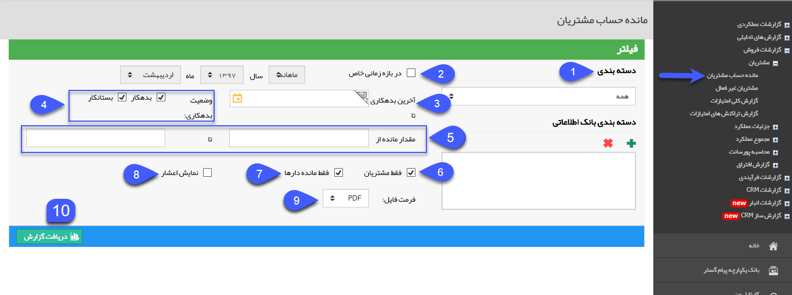
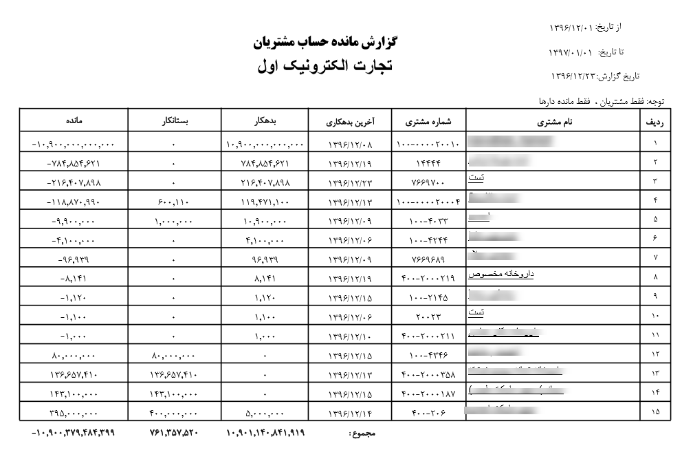

## مانده حساب مشتریان

> مسیر دسترسی: **مدیریت و گزارشات** >**گزارشات فروش** > **مشتریان** > **مانده حساب مشتریان**

نکته : لازم به ذکر است کاربر برای دریافت این گزارش بایستی مجوز مدیر فروش یا مدیر مالی را داشته باشید.

در این گزارش شما می توانید بدهکاری و بستانکاری مشتریان را بر اساس پارامترهای دلخواه مشخص دریافت کنید. 

1. دسته بندی: میتوانید منبع مورد نظر (دسته بندی بانک اطلاعاتی یا گروه های هدف) برای گزارش گیری را انتخاب کرده و از میان دسته بندی های زیر مجموعه آن، موارد دلخواه را با استفاده از علامت پلاس اضافه کنید.

2. فیلتر بازه زمانی: در صورتی که بخواهید گزارش تراز حساب مشتریان را برای بازه زمانی خاصی دریافت کنید، می توانید این گزینه را فعال نموده و سپس بازه زمانی مورد نظر خود را تعیین کنید.

3. آخرین بدهکاری: تاریخ آخرین بدهکاری یا بستانکاری مشتری (ثبت فاکتور، قرارداد مالی، دریافت و پرداخت ) را تعیین کنید.

4. وضعیت بدهکاری: وضعیت تراز مالی مخاطبانی (بدهکار، بستانکار) که مایل به گزارش گیری از آنها هستید، را انتخاب کنید.

5. مقدار مانده: بازه حداقل و حداکثر بدهی یا بستانکاری مشتریان را درج کنید.

6. فقط مشتریان: با فعال نمودن این گزینه نرم افزار تنها کسانی که شماره مشتری به آن ها اختصاص داده شده را مورد گزارش گیری قرار میدهد.

7. فقط مانده دار ها: با فعال کردن این گزینه تنها مشتریانی که تراز حساب آنها غیر صفر است را نمایش میدهد.   

8.  نمایش اعشار: در صورت غیر فعال بودن این گزینه، مبالغ نمایش داده شده در خروجی این گزارش به صورت صحیح خواهند بود.

9. فرمت فایل: مشخص کنید که فایل خروجی گزارش با چه فرمتی ( PDF، Excel یا Html ) باشد.

10. دریافت گزارش: پس از اعمال فیلترهای مورد نظر خود می توانید با کلیک بر روی این دکمه، گزارش تراز حساب مشتریان را دریافت کنید

