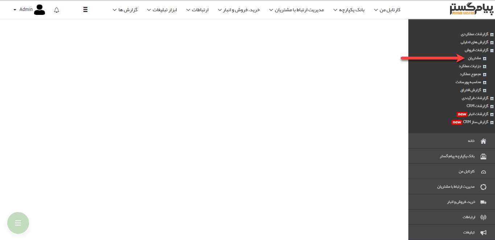

## مشتریان

در این قسمت می توانید گزارش تراز حساب مشتریان را دریافت کنید و همچنین می توانید گزارش مشتریانی که در بازه مشخصی از شما خریداری نکرده اند (غیرفعال بوده اند) را دریافت کنید

> نکته: برای دریافت این گزارش ها بایستی مجوز مدیر مالی یا مدیر فروش را داشته باشید.

[مانده حساب مشتریان](https://github.com/1stco/PayamGostarDocs/blob/master/help%202.5.4/Management-and-reports/Sales-reports/Customers/Customer-account-balance/Customer-account-balance.md)

[مشتریان غیر فعال](https://github.com/1stco/PayamGostarDocs/blob/master/help%202.5.4/Management-and-reports/Sales-reports/Customers/Inactive-customers/Inactive-customers.md)

[گزارش کلی امتیازات](https://github.com/1stco/PayamGostarDocs/blob/master/help%202.5.4/Management-and-reports/Sales-reports/Customers/General-score-report/General-score-report.md)

[گزارش تراکنش های امتیازات](https://github.com/1stco/PayamGostarDocs/blob/master/help%202.5.4/Management-and-reports/Sales-reports/Customers/Score-transaction-report/Score-transaction-report.md)

[گزارش امتیازات مصرف شد](https://github.com/1stco/PayamGostarDocs/blob/master/help%202.5.4/Management-and-reports/Sales-reports/Customers/Report-the-points-consumed/Report-the-points-consumed.md)ه

 

 