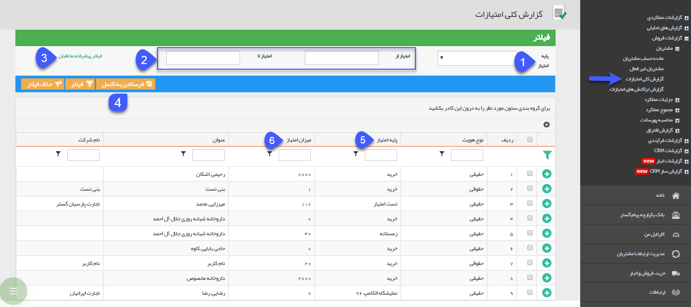

## گزارش کلی امتیازات

در این گزارش شما می توانید لیست جمع امتیازات کسب شده توسط مشتریان را به تفکیک پایه امتیاز های مختلف مشاهده نمایید. امکان تهیه خروجی اکسل نیز از این اطلاعات وجود دارد.

> نکته : برای دریافت این گزارش بایستی مجوز مشاهده امتیازات مشتریان را داشته باشید.

1. پایه امتیاز: برای فیلتر کردن یک پایه امتیاز به خصوص از این فیلد استفاده کنید.

2. بازه امتیاز: می توانید بازه امتیاز مشتریان را برای فیلتر کردن درج نمایید.

3. فیلتر پیشرفته مخاطبان: برای استفاده از فیلتر های مختلف مرتبط با پروفایل مخاطبان (مانند نام، آدرس و ...) از این فیلد استفاده کنید.

4. فرستادن به اکسل: با کلیک بر روی این کلید می توانید فایل اکسل حاوی مقادیر این لیست را دریافت نمایید.

5. پایه امتیاز: پایه امتیازی که برای محاسبه مورد استفاده قرار گرفته است را در این ستون مشاهده می نمایید.

6. امتیاز: مجموع امتیاز مشتری برای هر پایه امتیاز را در این ستون مشاهده می نمایید.