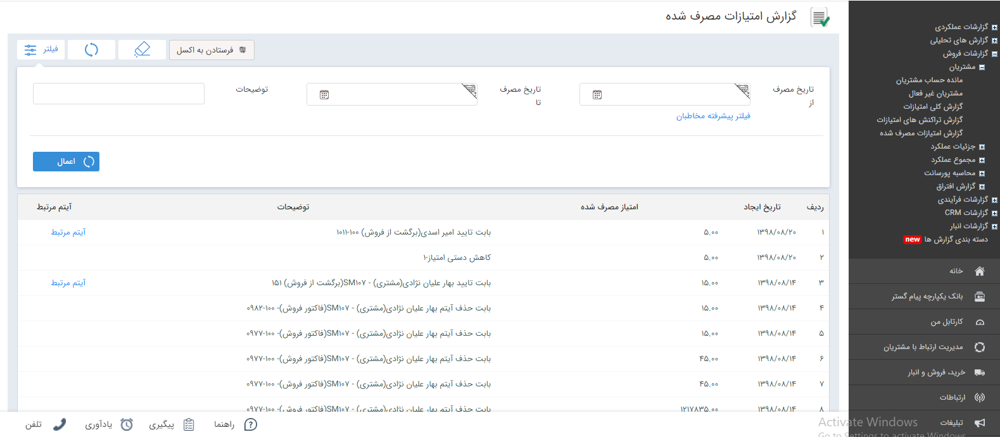

## گزارش امتیازات مصرف شده 

>  مسیر دسترسی:  **مدیریت و گزارشات** >**گزارشات فروش** > **مشتریان** > **گزارش امتیازات مصرف شده** 

نکته : لازم به ذکر است برای دریافت این گزارش بایستی  مشاهده‌ی امتیازات مشتری را داشته باشید.

در گزارشات فروش بخش مشتریان با استفاده از این گزارش میتوانید لیست تراکنش های امتیاز که مصرف شده اند را به همراه میزان مصرف امتیاز توضیحات و به همراه آیتم مرتبط مشاهده کرد.

> نکته : برای دریافت این گزارش بایستی مجوز مشاهده امتیازات مشتریان را داشته باشید.

تاریخ مصرف از/ تا :  میتوانید براساس تاریخ مصرف، تراکنش های امتیازات مصرف شده را فیلتر و جستجو کرد.

توضیحات : میتوانید براساس فیلد توضیحات، تراکنش های امتیاز های مصرف شده را جستجو کرد.

 فیلتر پیشرفته مخاطبان:  برای استفاده از فیلتر های مختلف مرتبط با پروفایل مخاطبان (مانند نام، آدرس و ...) از این فیلد استفاده کنید.