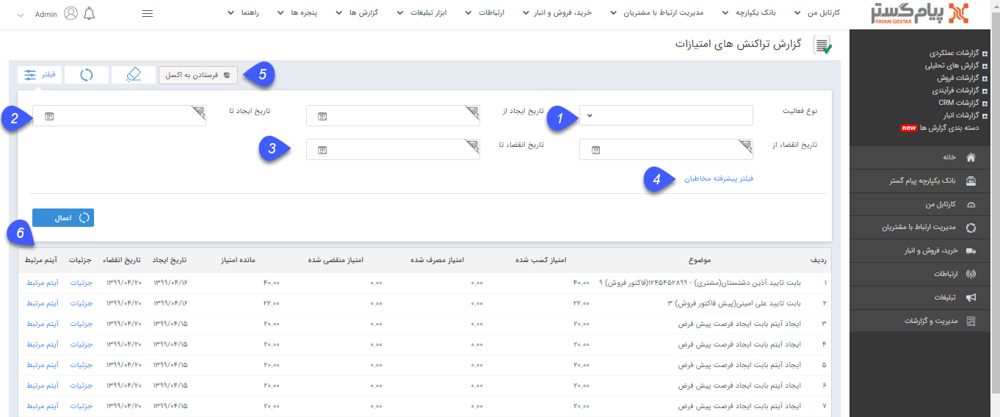

## گزارش تراکنش های امتیازات

در گزارشات فروش بخش مشتریان با استفاده از این گزارش میتوانید لیست تراکنش های امتیازات مخاطبان ( عملیاتی که توسط آن مخاطب امتیازی را کسب یا مصرف کرده است)، به همراه میزان امتیاز کسب شده ، مصرف شده و منقضی شده و جزییات آیتم مرتبط با این امتیاز  مشاهده کنید.

> نکته :  برای دریافت این گزارش بایستی مجوز مشاهده امتیازات مشتریان را داشته باشید.

1.	می‌توانید براساس نوع فعالیت تعریف شده برای امتیاز جستجو کنید.

2.	 تاریخ ایجاد از/تا:  به کمک این فیلدها، تاریخ ایجاد تراکنش امتیازها جهت جستجو محدود می شود.

3.	تاریخ انقضا از/تا:  به کمک این فیلدها، تاریخ انقضای پایه امتیازها جهت جستجو محدود می شود.

4.	فیلتر پیشرفته مخاطبان:  برای استفاده از فیلتر های مختلف مرتبط با پروفایل مخاطبان (مانند نام، آدرس و ...) از این فیلد استفاده کنید.

5.	فرستادن به اکسل: با کلیک بر روی این کلید می توانید فایل اکسل حاوی مقادیر این لیست را دریافت نمایید.

6.	آیتم مرتبط با هر تراکنش نمایش داده می‌شود.

