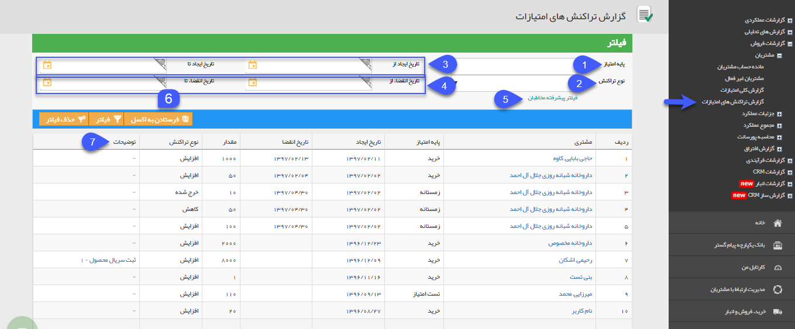

## گزارش تراکنش های امتیازات

در این گزارش میتوانید لیست تراکنش های امتیازات مخاطبان ( عملیاتی که توسط آن مخاطب امتیازی را کسب یا مصرف کرده است)، به همراه میزان امتیاز کسب شده ، مصرف شده و منقضی شده و جزییات آیتم مرتبط با این امتیاز  مشاهده کنید.

> نکته :  برای دریافت این گزارش بایستی مجوز مشاهده امتیازات مشتریان را داشته باشید.

1.  پایه امتیاز:  برای فیلتر کردن یک پایه امتیاز به خصوص از این فیلد استفاده کنید.

2. نوع تراکنش: نوع تراکنش (افزایش، کاهش یا خرج شده) مورد نظر خود را جهت جستجو مشخص کنید.  

 3. تاریخ ایجاد از/تا:  به کمک این فیلدها، تاریخ ایجاد تراکنش امتیازها جهت جستجو محدود می شود.

  4.  تاریخ انقضا از/تا:  به کمک این فیلدها، تاریخ انقضای پایه امتیازها جهت جستجو محدود می شود.

 5.   فیلتر پیشرفته مخاطبان:  برای استفاده از فیلتر های مختلف مرتبط با پروفایل مخاطبان (مانند نام، آدرس و ...) از این فیلد استفاده کنید.

6. فرستادن به اکسل: با کلیک بر روی این کلید می توانید فایل اکسل حاوی مقادیر این لیست را دریافت نمایید.

7. توضیحات: در صورتی که تراکنش افزایش امتیاز از طریق تایید اصالت کالا ثبت شده باشد، در این قسمت می توانید شماره سریال کالای مربوطه و لینک ویرایش قلم کالای مربوط به آن را مشاهده نمایید.