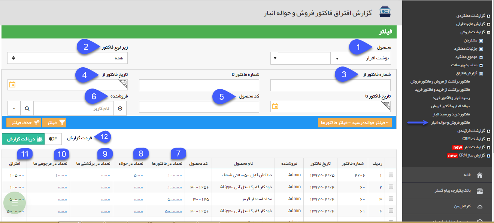
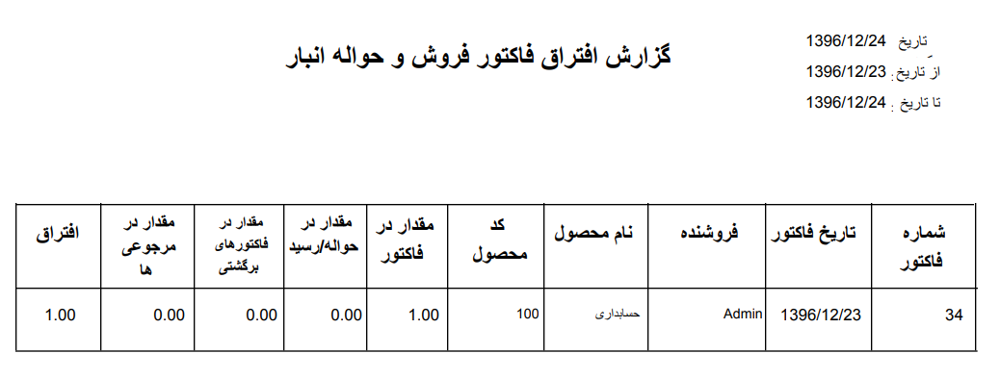

## فاکتور فروش و حواله انبار

> مسیر دسترسی: **مدیریت و گزارشات** >**گزارشات فروش** > **گزارش افتراق** > **فاکتور فروش و حواله انبار**

در این قسمت لیست فاکتور فروش هایی که همه یا تعدادی از اقلام موجود در آن ها از طریق [قیمت گذاری](https://github.com/1stco/PayamGostarDocs/blob/master/help%202.5.4/Buy-warehouse-sales/Store/gheymatgozari-etesal/gheymatgozari.md) به هیچ حواله انباری وصل نشده است یا از طریق فاکتور برگشت از فروش مرجوع نشده است را می توانید مشاهده کنید.

(به زبان دیگر فاکتور فروش کالا صادر شده است اما مرجوع نشده است و مشخص نیست که کالا از انبار خارج شده است یا خیر)

هر ردیف از جدول نمایش داده شده در این گزارش، نشان دهنده فروش یک محصول می باشد که تعداد فروخته شده از جمع تعداد مرجوع شده ها و اقلام خارج شده به انبار بیشتر است. نحوه نمایش این گزارش به ازای هر ردیف محصول از فاکتورهای فروش می باشد. یعنی اگر در یک فاکتور فروش دو ردیف محصول وارد شده باشد که تعدادی از اقلام کالای هر دو ردیف به هیچ فاکتور برگشت از فروش یا حواله انبار متصل نشده باشند، گزارش افتراق آن ها در دو ردیف مجزا نمایش داده خواهد شد.

1. فیلتر محصول: می توانید گروه محصول یا محصول مورد نظر خود که قصد مشاهده گزارش افتراق مربوط به آن را دارید، انتخاب نمایید.

2. زیرنوع فاکتور: می توانید یکی از زیرنوع های فاکتور فروش تعریف شده در نرم افزار را انتخاب کنید. در این صورت گزارش افتراق مربوط به همان زیرنوع از فاکتور نمایش داده خواهد شد.

3. شماره فاکتور از/تا: می توانید یک حد پایین و یک حد بالا برای شماره فاکتورهای فروشی که قصد مشاهده گزارش افتراق مربوط به آن ها را دارید، در نظر بگیرید.

4. تاریخ فاکتور از/تا: می توانید یک حد پایین و یک حد بالا برای تاریخ فاکتورهای فروشی که قصد مشاهده گزارش افتراق مربوط به آن ها را دارید، در نظر بگیرید.

5. کد محصول: می توانید در این قسمت کد محصولی که قصد مشاهده گزارش افتراق مربوط به آن را دارید، وارد کنید.

6. فروشنده: می توانید از بین کاربران نرم افزار، فروشنده فاکتور فروش هایی که قصد مشاهده گزارش افتراق مربوط به آن ها را دارید، مشخص کنید.

7. تعداد در فاکتورها: در این ستون، به ازای هر فاکتور فروش که همه یا تعدادی از اقلام کالای آن به هیچ حواله انباری متصل نشده اند یا مرجوع نشده اند، تعداد محصول وارد شده در فاکتور فروش نمایش داده می شود، می توانید یا کلیک بر روی لینک نمایش داده شده، فاکتور فروش مربوطه را مشاهده نمایید.

8. تعداد در حواله: در صورتی که برخی از اقلام کالا از طریق قیمت گذاری حواله های انبار به این فاکتور فروش متصل شده باشند، تعداد اتصال داده شده در این قسمت نمایش داده می شود. می توانید یا کلیک بر روی لینک نمایش داده شده، حواله/حواله های انبار مربوطه را مشاهده نمایید.

9. تعداد در برگشتی ها: در صورتی که برخی از اقلام کالای فروخته شده از طریق فاکتور برگشت از فروش مرجوع شده باشند و فاکتور برگشت از فروش به این فاکتور فروش نگاشت شده باشد، تعداد وارد شده در فاکتور برگشت از فروش در این قسمت نمایش داده می شود، می توانید یا کلیک بر روی لینک نمایش داده شده، فاکتور/فاکتورهای برگشت از فروش مربوطه را مشاهده نمایید.

10. تعداد در مرجوعی ها: در صورتی که تعدادی از اقلام کالای حواله شده (خارج شده از انبار) از طریق رسید مرجوعی به انبار وارد شوند و آن رسید مرجوعی از طریق قیمت گذاری به حواله انبار اتصال داده شود (توجه داشته باشید که رسید مرجوعی باید به حواله انباری اتصال داده شود که به این فاکتور فروش متصل شده باشد)، تعداد وارد شده در رسید مرجوعی در این قسمت نمایش داده می شود. می توانید یا کلیک بر روی لینک نمایش داده شده، رسید/رسید های مرجوعی مربوطه را مشاهده نمایید.

11. افتراق: میزان افتراق محصول در این قسمت نمایش داده خواهد شد. این عدد از طریق زیر به دست می آید:

افتراق= تعداد در فاکتور - (تعداد در حواله ها- تعداد در مرجوعی ها) - تعداد در برگشتی ها

12. دریافت گزارش: پس از اعمال فیلترهای مورد نظر خود، می توانید اطلاعات نمایش داده شده را با فرمت دلخواه از نرم افزار خروجی بگیرید. شکل زیر نمونه ای از خروجی با فرمت pdf از گزارش افتراق فاکتور فروش و حواله انبار را نمایش می دهد.

