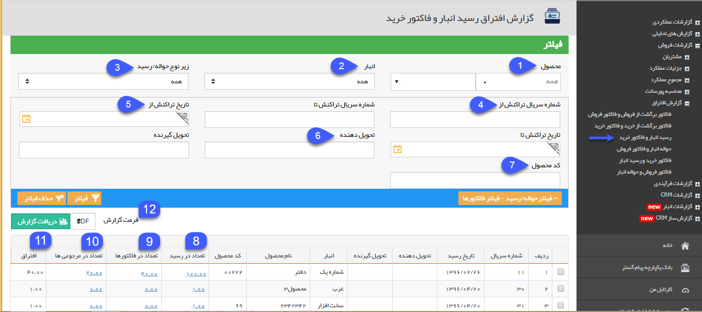
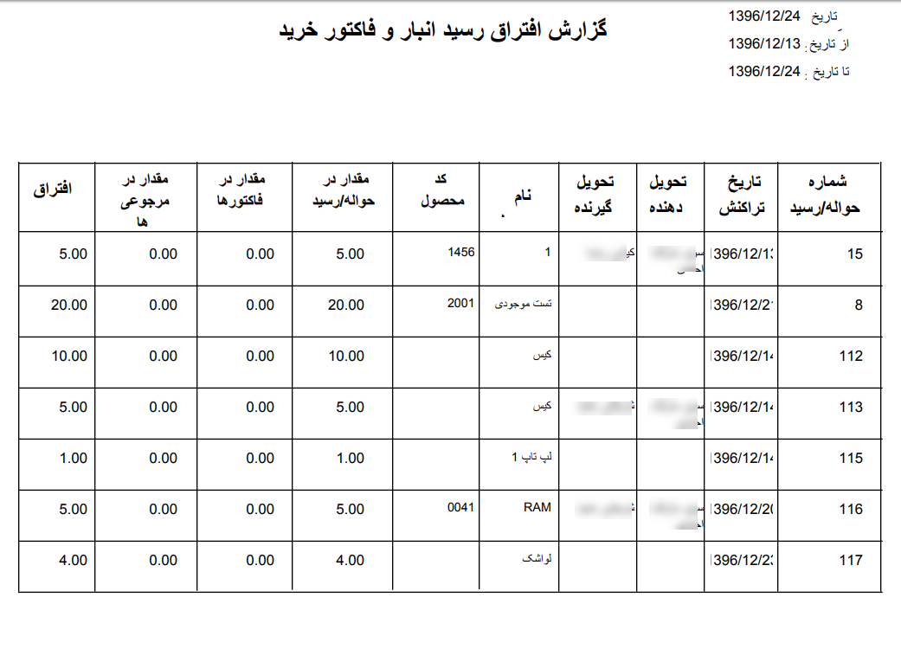

## رسید انبار و فاکتور خرید

در این قسمت لیست رسید هایی که همه یا تعدادی از اقلام موجود در آن ها از طریق[ قیمت گذاری ](https://github.com/1stco/PayamGostarDocs/blob/master/help%202.5.4/Buy-warehouse-sales/Store/gheymatgozari-etesal/gheymatgozari.md)به هیچ فاکتور خرید یا حواله مرجوعی وصل نشده است را می توانید مشاهده کنید.

(به زبان دیگر کالا وارد انبار شده است اما مشخص نیست که متعلق به کدام فاکتور خرید می باشد یا از طریق کدام حواله مرجوع شده است.)

هر ردیف از جدول نمایش داده شده در این گزارش، نشان دهنده ورود یک محصول به انبار می باشد که تعداد وارد شده به انبار از تعداد اتصال آن ها با فاکتورهای خرید و حواله های مرجوعی بیشتر است. نحوه نمایش این گزارش به ازای هر ردیف محصول از رسیدهای انبار می باشد. یعنی اگر در یک رسید انبار دو ردیف محصول وارد شده باشد که تعدادی از اقلام کالای هر دو ردیف به هیچ فاکتور خرید یا حواله مرجوعی متصل نشده باشند، گزارش افتراق آن ها در دو ردیف مجزا نمایش داده خواهد شد

1. فیلتر محصول: می توانید گروه محصول یا محصول مورد نظر خود که قصد مشاهده گزارش افتراق مربوط به آن را دارید، انتخاب نمایید.

2. انبار: از آنجایی که این گزارش افتراق به ازای هر رسید انبار نمایش داده می شود، می توانید از بین انبارهای تعریف شده در نرم افزار، یک انبار را فیلتر کنید تا تراکنش های مربوط به آن انبار در گزارش نمایش داده شوند.

3. زیرنوع رسید: می توانید یکی از زیرنوع های رسید انبار را انتخاب نمایید. در این صورت تراکنش های ثبت شده از آن زیرنوع رسید در گزارش نمایش داده خواهد شد.

4. شماره سریال تراکنش از/تا: می توانید یک حد پایین و یک حد بالا برای سریال تراکنش هایی که قصد مشاهده گزارش افتراق مربوط به آن ها را دارید، در نظر بگیرید.

5. تاریخ تراکنش از/تا: می توانید یک حد پایین و یک حد بالا برای تاریخ تراکنش هایی که قصد مشاهده گزارش افتراق مربوط به آن ها را دارید، در نظر بگیرید.

6. تحویل دهنده/تحویل گیرنده: می توانید تحویل دهنده یا تحویل گیرنده رسیدهای انباری که قصد مشاهده گزارش افتراق مربوط به آن ها را دارید، مشخص کنید.

7. کد محصول: می توانید در این قسمت کد محصولی که قصد مشاهده گزارش افتراق مربوط به آن را دارید، وارد کنید.

8. تعداد در رسید: در این ستون، به ازای هر رسید انبار که همه یا تعدادی از اقلام کالای آن به هیچ فاکتور خریدی متصل نشده اند یا مرجوع نشده اند، تعداد محصول وارد شده در رسید انبار نمایش داده می شود، می توانید یا کلیک بر روی لینک نمایش داده شده، رسید انبار مربوطه را مشاهده نمایید.

9. تعداد در فاکتورها: در صورتی که برخی از اقلام کالا در رسید انبار از طریق فاکتورهای خرید و تعداد دیگری به صورت دستی قیمت گذاری شده باشند، تعداد اتصال داده شده به فاکتورهای خرید در این قسمت نمایش داده می شود، می توانید یا کلیک بر روی لینک نمایش داده شده، فاکتورهای خرید مربوطه را مشاهده نمایید.

10. تعداد در مرجوعی ها: در صورتی که تعدادی از اقلام کالای وارد شده در این رسید انبار مرجوع شده باشند و در حواله مرجوعی مربوطه از طریق اتصال به رسید قیمت گذاری شده باشند، در این قسمت تعداد وارد شده در حواله مرجوعی نمایش داده خواهد شد. می توانید یا کلیک بر روی لینک نمایش داده شده، حواله/حواله های مرجوعی مربوطه را مشاهده نمایید.

11. افتراق: میزان افتراق محصول در این قسمت نمایش داده خواهد شد. این عدد از کسر تعداد در فاکتورها و تعداد در مرجوعی ها از تعداد در رسید به دست می آید.

12. دریافت گزارش: پس از اعمال فیلترهای مورد نظر خود، می توانید اطلاعات نمایش داده شده را با فرمت دلخواه از نرم افزار خروجی بگیرید. شکل زیر نمونه ای از خروجی با فرمت pdf از گزارش افتراق رسید انبار و فاکتور خرید را نمایش می دهد.

