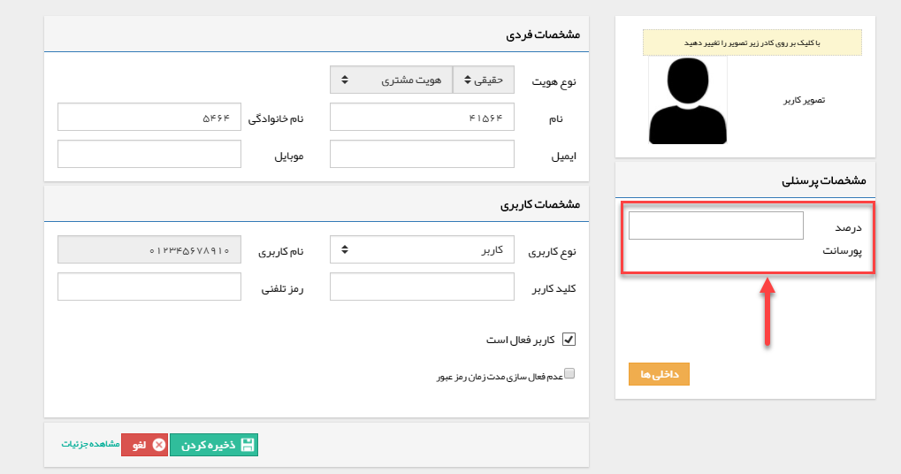
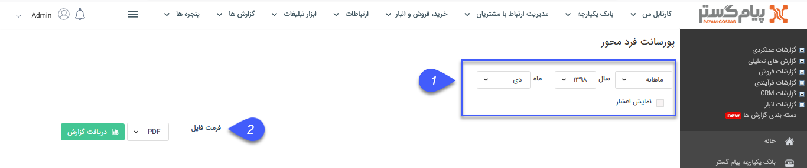
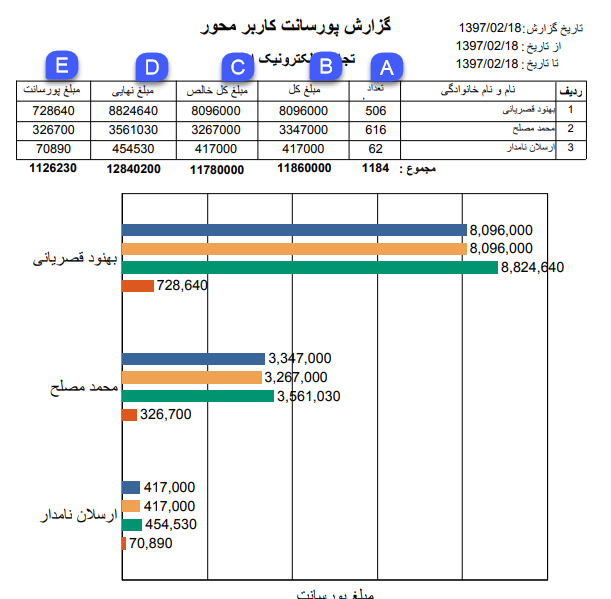

## پورسانت فرد محور

در [مدیریت گروه و کاربران](https://github.com/1stco/PayamGostarDocs/blob/master/help%202.5.4/Settings/Manage-groups-and-users/Manage-groups-and-users.md) همانطور که در شکل دیده می شود می توان برای هر کدام از کاربران درصد پورسانتی را مشخص کرد. ب

این گزارش مشخص می کند در بازه زمانی مشخص شده، هر کدام از کاربران چه تعداد محصول به فروش رسانده اند و مبلغ پورسانت هر کدام چه مبلغی شده است.

> نکته : برای دریافت این گزارش دارا بودن مجوز مدیر فروش الزامی میباشد.

1 . فیلتر: در قسمت فیلترها، با توجه به بازه زمانی مورد نظر، فیلدها را پر نمایید.

2 . فرمت فایل: در قسمت فرمت فایل، نوع فایل خروجی را انتخاب کرده و روی دریافت گزارش کلیک کنید تا گزارش مورد نظر دانلود شود.

A تعداد محصولات فروخته شده توسط کارشناس در این قسمت نمایش داده می شود

B جمع مبلغ کل فاکتورهای فروخته شده توسط کارشناس (مبلغ قبل از اعمال تخفیف و مالیات) در این قسمت نمایش داده می شود

C جمع مبلغ خالص فاکتورهای فروخته شده توسط کارشناس ( مبلغ پس از اعمال تخفیف) در این قسمت نمایش داده می شود

D جمع مبلغ نهایی فاکتورهای فروخته شده توسط کارشناس ( مبلغ پس از اعمال تخفیف و مالیات) در این قسمت نمایش داده می شود

E پورسانت تعلق گرفته به کارشناس که از حاصل ضرب درصد پورسانت تعیین شده برای او در جمع مبالغ خالص فاکتورهای فروخته شده بدست می آید در این قسمت نمایش داده خواهد شد

> نکته مهم: توجه داشته باشید برای محاسبه پورسانت مربوط به یک کارشناس در یک فاکتور فروش، باید نام کاربری او در فیلد "فروشنده" درج شده باشد

