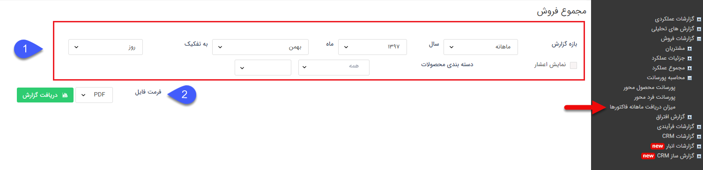
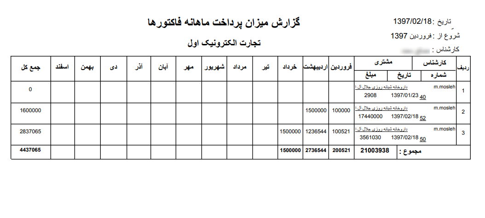

## میزان دریافت ماهانه فاکتورها

> مسیر دسترسی: **مدیریت و گزارشات** >**گزارشات فروش** > **محاسبه پروسانت** > **میزان دریافت ماهانه فاکتورها**

نکته : لازم به ذکر است برای دریافت این گزارش بایستی مجوز مدیر فروش یا مدیر مالی را داشته باشید.

مبلغ فاکتورهای صادر شده در یک بازه یکساله و پرداخت های لینک شده به هر یک از فاکتورها توسط کاربران را نمایش می دهد تا بر اساس آن بتوان مبلغی از هزینه فاکتورها که تاکنون دریافت شده است را بدست آورد.

> نکته: پرداخت های غیرنقدی پس از وصول شدن در این گزارش مورد محاسبه قرار می گیرند.

> نکته : برای دریافت این گزارش دارا بودن مجوز مدیر فروش  و یا مدیر مالی  الزامی میباشد.

1  فیلتر: در قسمت فیلترها، میتوانید بازه زمانی و همچنین محصول مورد نظر را برای دریافت گزارش را تعیین کنید، همچنین کارشناس فروش مورد نظر خود را نیز از بین کاربران نرم افزار انتخاب نمایید

2  فرمت فایل: در قسمت فرمت فایل، نوع فایل خروجی را انتخاب کرده و روی دریافت گزارش کلیک کنید تا گزارش مورد نظر دانلود شود

همانطور که ملاحظه می کنید در جدول خروجی این گزارش، هر ردیف یکی از فاکتورها و جمع مبلغ دریافت های لینک شده به فاکتور را نشان می دهد. توجه داشته باشید که بر اساس "تاریخ دریافت" وارد شده، مبلغ هر دریافت در ماه مربوط به آن لحاظ خواهد شد.

