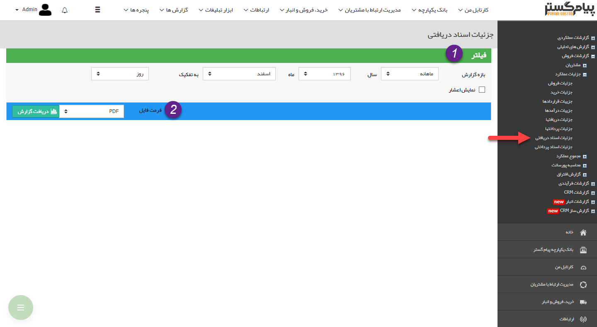
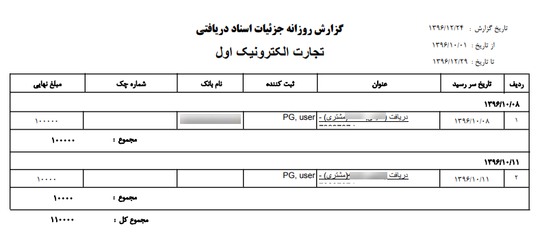

## جزئیات اسناد دریافتی

> مسیر دسترسی: **مدیریت و گزارشات** >**گزارشات فروش** > **جزئیات عملکرد** > **جزئیات اسناد دریافتی**

 در این گزارش تمامی دریافت های چکی و اعتباری که تاریخ سررسید آن ها در بازه زمانی مشخص شده باشد،  نمایش داده می شود

> نکته: توجه داشته باشید که تاریخ ایجاد دریافت ها در این گزارش تاثیری ندارد و تاریخ سررسید اهمیت دارد

> نکته: توجه داشته باشید، این گزارش مربوط به اسناد دریافت نشده می باشد و در صورتی که چک باکس "دریافت شده" در یک دریافت، فعال شده باشد، گزارش مربوط به آن بر اساس تاریخ دریافت در گزارش[ جزئیات دریافت ها](https://github.com/1stco/PayamGostarDocs/blob/master/help%202.5.4/Management-and-reports/Sales-reports/Performance-details/Details-of-receipts/Details-of-receipts.md) قابل مشاهده است

> نکته : برای دریافت این گزارش دارا بودن مجوز مدیر مالی و یا مدیر فروش الزامی میباشد

1)  فیلتر: در قسمت فیلترها، با توجه به بازه زمانی مورد نظر، فیلدها را پر نمایید

2) فرمت فایل:  در قسمت فرمت فایل، نوع فایل خروجی را انتخاب کرده و روی دریافت گزارش کلیک کنید تا گزارش مورد نظر دانلود شود

