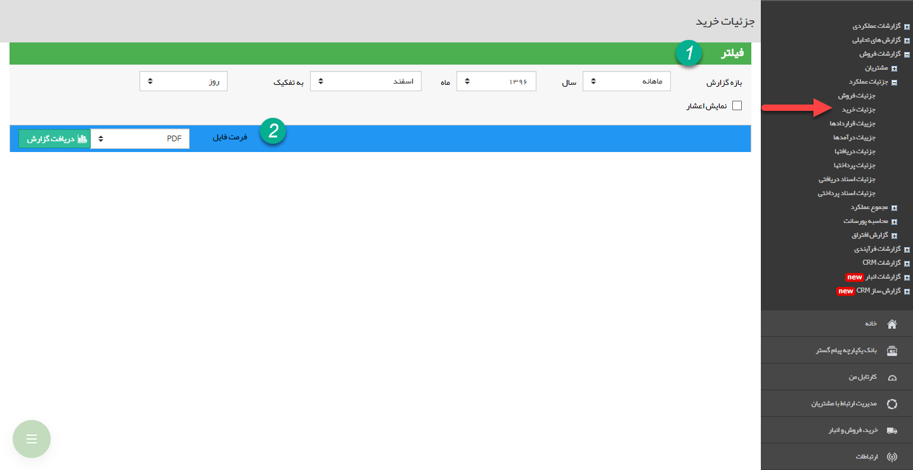
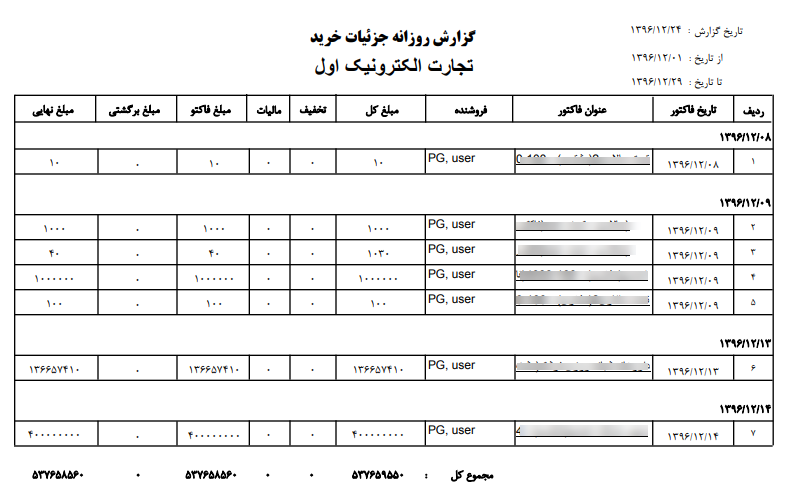

## جزئیات خرید   

>  مسیر دسترسی:  **مدیریت و گزارشات** >**گزارشات فروش** > **جزئیات عملکرد** > **جزئیات خرید** 

نکته : لازم به ذکر است برای دریافت این گزارش بایستی مجوز مدیر فروش یا مدیر مالی را داشته باشید.

در این گزارش جزئیات فاکتورهای خرید در بازه زمانی انتخاب شده نمایش داده می شود

> نکته : برای دریافت این گزارش بایستی مجوز مدیر فروش یا مدیر مالی داشته باشید.

1) فیلتر: در قسمت فیلترها، با توجه به بازه زمانی مورد نظر، فیلدها را پر نمایید

2) فرمت فایل:  در قسمت فرمت فایل، نوع فایل خروجی را انتخاب کرده و روی دریافت گزارش کلیک کنید تا گزارش مورد نظر دانلود شود

