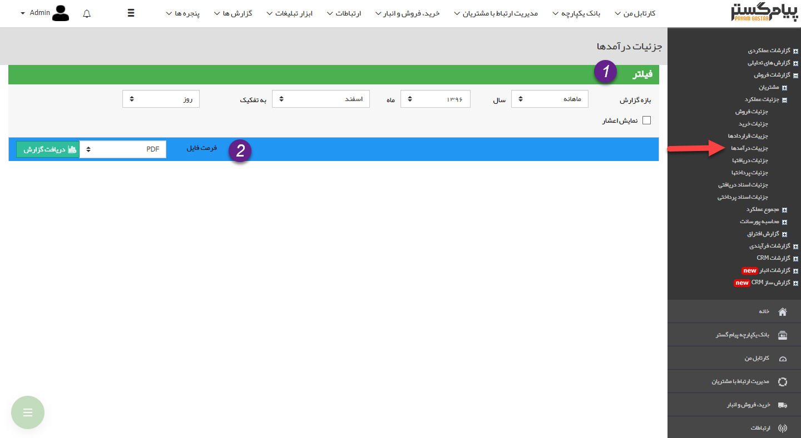
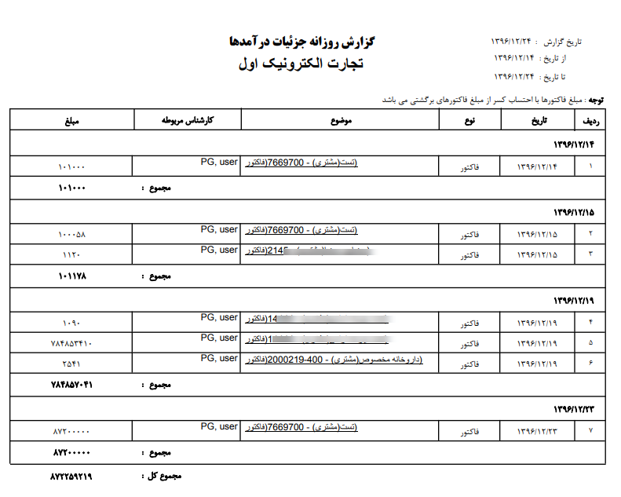

## جزئیات درآمدها

> مسیر دسترسی: **مدیریت و گزارشات** >**گزارشات فروش** > **جزئیات عملکرد** > **جزئیات درآمدها**

نکته : لازم به ذکر است برای دریافت این گزارش بایستی مجوز مدیر فروش یا مدیر مالی را داشته باشید.

در این گزارش جزئیات فاکتورهای فروش و قراردادهایی که جنبه مالی دارند و همچنین کارشناس مربوطه را در بازه زمانی مشخص شده نشان داده می شود.

> نکته : برای دریافت این گزارش دارا بودن مجوز مدیر مالی و یا مدیر فروش الزامی میباشد.

1)فیلتر:در قسمت فیلترها، با توجه به بازه زمانی مورد نظر، فیلدها را پر نمایید

2) فرمت فایل:  در قسمت فرمت فایل، نوع فایل خروجی را انتخاب کرده و روی دریافت گزارش کلیک کنید تا گزارش مورد نظر دانلود شود

