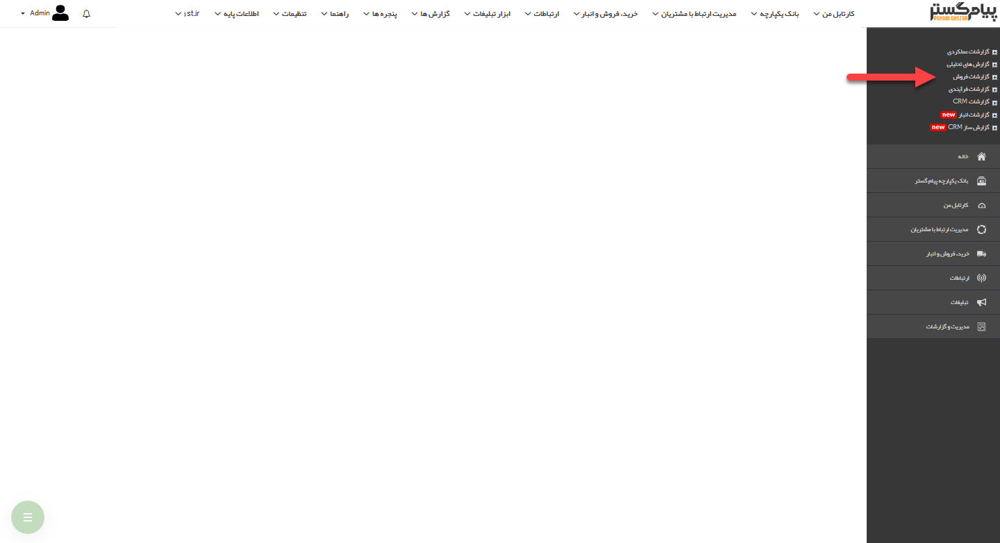

## گزارشات فروش 

گزارش جزئیات فروش، خرید، دریافت/پرداخت، تراز حساب مشتریان، امتیازت، افتراق سوابق مرتبط (به طور مثال فاکتور برگشت از فروش و فاکتور فروش) و همچنین گزارش پورسانت کاربران را می توانید از این قسمت دریافت نمایید.

[مشتریان](https://github.com/1stco/PayamGostarDocs/blob/master/help%202.5.4/Management-and-reports/Sales-reports/Customers/Customers.md)

[جزئیات عملکرد](https://github.com/1stco/PayamGostarDocs/blob/master/help%202.5.4/Management-and-reports/Sales-reports/Performance-details/Performance-details.md)

[مجموع عملکرد](https://github.com/1stco/PayamGostarDocs/blob/master/help%202.5.4/Management-and-reports/Sales-reports/Total-performance/total-performance.md)

[محاسبه پورسانت](https://github.com/1stco/PayamGostarDocs/blob/master/help%202.5.4/Management-and-reports/Sales-reports/Payroll-calculation/Payroll-calculation.md)

[گزارشات فتراق](https://github.com/1stco/PayamGostarDocs/blob/master/help%202.5.4/Management-and-reports/Sales-reports/Differentiation-reports/Differentiation-reports.md)