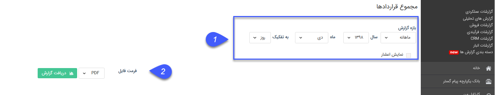
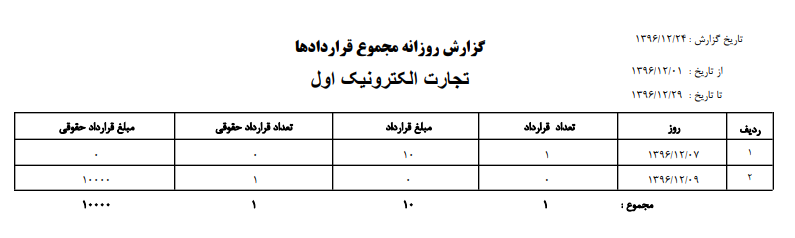

## مجموع قراردادها

در این گزارش تعداد قراردادهای مالی به انضمام مبلغشان و حقوقی تایید شده در بازه زمانی انتخاب شده، نمایش داده می شود.

> نکته : برای دریافت این گزارش دارا بودن مجوز مدیر مالی و یا مدیر فروش الزامی میباشد.

1)    فیلتر: در قسمت فیلترها، با توجه به بازه زمانی مورد نظر، فیلدها را پر نمایید

2) فرمت فایل: در قسمت فرمت فایل، نوع فایل خروجی را انتخاب کرده و روی دریافت گزارش کلیک کنید تا گزارش مورد نظر دانلود شود

> نکته: توجه داشته باشید که تاریخ شروع قراردادهای نمایش داده شده در این گزارش باید در بازه زمانی مشخص شده باشند.

