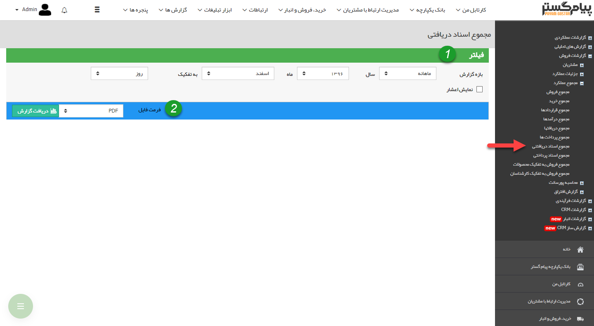

## مجموع اسناد دریافتی

> مسیر دسترسی: **مدیریت و گزارشات** >**گزارشات فروش** > **مجموع عملکرد** > **مجموع اسناد دریافتی**

نکته : لازم به ذکر است برای دریافت این گزارش بایستی مجوز مدیر فروش یا مدیر مالی را داشته باشید.

در این گزارش مجموع تمامی دریافت های چکی و اعتباری که تاریخ سررسید آن ها در بازه زمانی مشخص شده باشد، به همراه مبالغ آن ها نمایش داده می شود

> نکته: توجه داشته باشید که تاریخ ایجاد دریافت ها در این گزارش تاثیری ندارد و تاریخ سررسید اهمیت دارد

> نکته: توجه داشته باشید، این گزارش مربوط به اسناد دریافت نشده می باشد و در صورتی که چک باکس "دریافت شده" در یک دریافت، فعال شده باشد، گزارش مربوط به آن بر اساس تاریخ دریافت در گزارش <a href="file%3A%2F%2F%2FC%3A%5CUsers%5CH.abasi%5CDesktop%5Chelp%5Cmd%20help%5CManagement-and-reports%5CSales-reports%5CTotal-performance%5CTotal-receipts%5CTotal-receipts.md" target="_blank">مجموع دریافت ها</a> قابل مشاهده است

>  نکته : برای دریافت این گزارش دارا بودن مجوز مدیر مالی و یا مدیر فروش الزامی میباشد

1) فیلتر: در قسمت فیلترها، با توجه به بازه زمانی مورد نظر، فیلدها را پر نمایید

2) فرمت فایل: در قسمت فرمت فایل، نوع فایل خروجی را انتخاب کرده و روی دریافت گزارش کلیک کنید تا گزارش مورد نظر دانلود شود

