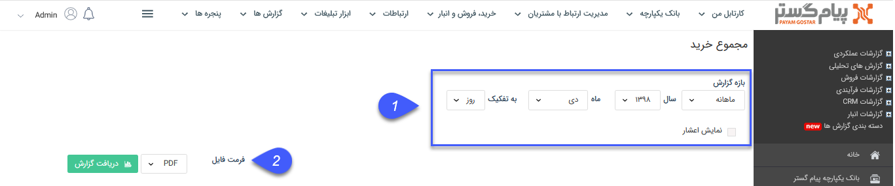
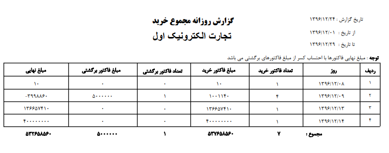

## مجموع خرید 

>  مسیر دسترسی:  **مدیریت و گزارشات** >**گزارشات فروش** > **مجموع عملکرد** > **مجموع خرید** 

نکته : لازم به ذکر است برای دریافت این گزارش بایستی مجوز مدیر فروش یا مدیر مالی را داشته باشید.

در این گزارش تعداد فاکتورهای خرید و فاکتورهای برگشت از خرید و مبالغ کل آنها در بازه زمانی انتخاب شده نمایش داده می شود. ب

> نکته: توجه داشته باشید که تنها فاکتورها و فاکتورهای برگشتی تایید شده در این گزارش لحاظ می شوند

> نکته : برای دریافت این گزارش دارا بودن مجوز مدیر مالی و یا مدیر فروش الزامی میباشد.

1)  فیلتر: در قسمت فیلترها، با توجه به بازه زمانی مورد نظر، فیلدها را پر نمایید

2) فرمت فایل:  در قسمت فرمت فایل، نوع فایل خروجی را انتخاب کرده و روی دریافت گزارش کلیک کنید تا گزارش مورد نظر دانلود شود

