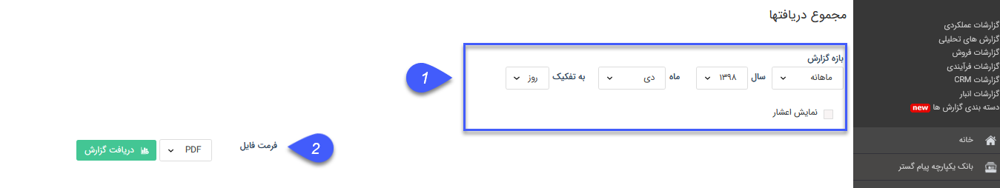

## مجموع دریافت ها

> مسیر دسترسی: **مدیریت و گزارشات** >**گزارشات فروش** > **مجموع عملکرد** > **مجموع دریافتها**

در این گزارش مجموع دریافت هایی که تاریخ دریافت آن ها در بازه زمانی مشخص شده باشد به تفکیک نوع دریافت (چکی، نقدی، اعتباری)نمایش داده می شود.

> نکته: توجه داشته باشید که تاریخ ایجاد دریافت ها در این گزارش تاثیری ندارد و تاریخ دریافت اهمیت دارد.

>  نکته : برای دریافت این گزارش دارا بودن مجوز مدیر مالی و یا مدیر فروش الزامی میباشد.

1) فیلتر: در قسمت فیلترها، با توجه به بازه زمانی مورد نظر، فیلدها را پر نمایید

2 )  فرمت فایل: در قسمت فرمت فایل، نوع فایل خروجی را انتخاب کرده و روی دریافت گزارش کلیک کنید تا گزارش مورد نظر دانلود شود

