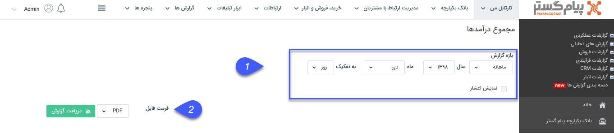
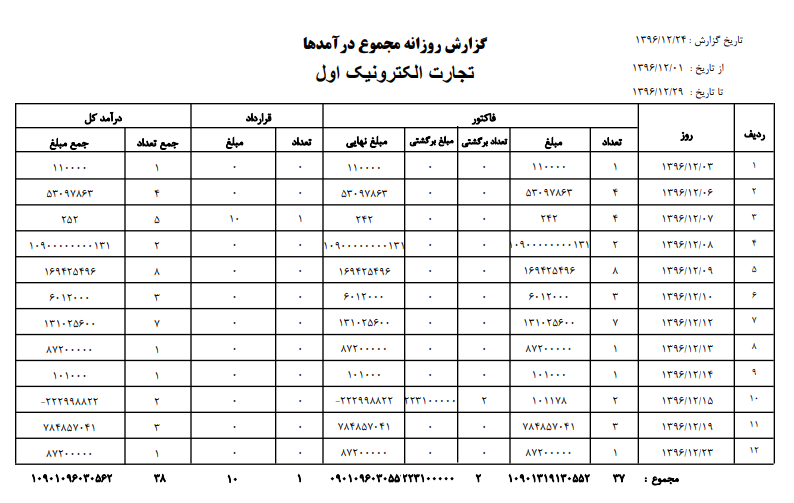

## مجموع درآمدها

> مسیر دسترسی: **مدیریت و گزارشات** >**گزارشات فروش** > **مجموع عملکرد** > **مجموع درآمدها**

در این گزارش تعداد فاکتورهای فروش، فاکتورهای برگشت از فروش و قراردادهایی که جنبه مالی دارند و همچنین مبلغ آنها در بازه زمانی مشخص شده نشان داده می شود.

> نکته : برای دریافت این گزارش دارا بودن مجوز مدیر مالی و یا مدیر فروش الزامی میباشد.

1) فیلتر: در قسمت فیلترها، میتوانید بازه زمانی مد نظرتان را برای دریافت این گزارش تعیین کنید

2) فرمت فایل: در قسمت فرمت فایل، نوع فایل خروجی را انتخاب کرده و روی دریافت گزارش کلیک کنید تا گزارش مورد نظر دانلود شود

