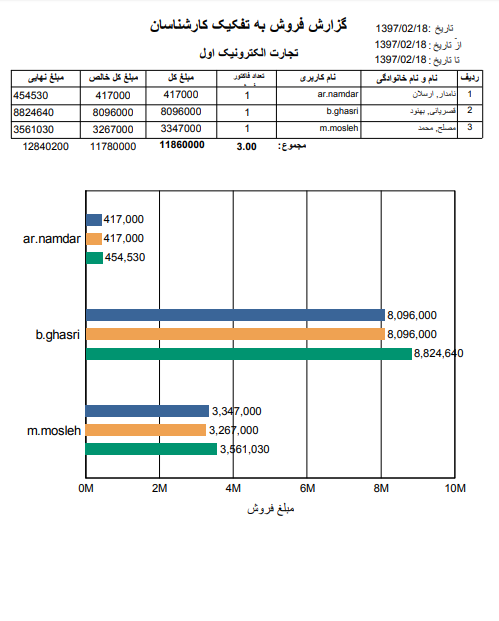

## مجموع فروش به تفکیک کارشناسان

در این گزارش مشخص می شود که هر کدام از کاربران سیستم چه تعداد فاکتور زده اند و مبلغ فروش کل به تفکیک هر کاربر در بازه زمانی مشخص شده به چه میزان بوده است

> نکته : برای دریافت این گزارش دارا بودن مجوز مدیر فروش الزامی است

1)فیلتر:در قسمت فیلترها، با توجه به بازه زمانی مورد نظر، فیلدها را پر نمایید

2)  فرمت فایل:در قسمت فرمت فایل، نوع فایل خروجی را انتخاب کرده و روی دریافت گزارش کلیک کنید تا گزارش مورد نظر دانلود شود

> نکته: مبلغ خالص، مبلغ فاکتورها پس از اعمال تخفیف و مبلغ نهایی، مبلغ پس از اعمال تخفیف و مالیات می باشد.

