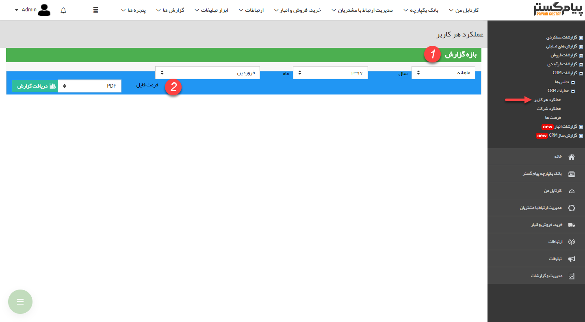
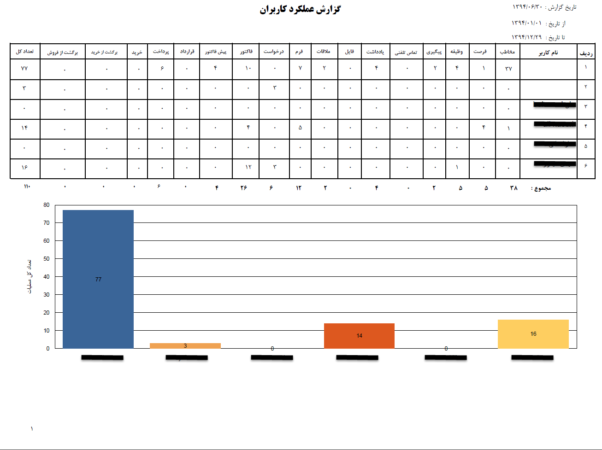

## عملکرد هر کاربر

>  مسیر دسترسی:  **مدیریت و گزارشات** >**گزارشات crm** > **عملیات crm** > **عملکرد هر کاربر** 

 بر اساس بازه زمانی انتخاب شده مشخص می کند که هر کاربر چه فعالیتهایی در نرم افزار داشته است. این گزارش تمامی انواع سوابق (تماس تلفنی، یادداشت، قرار و ...) را شامل می شود.ب

برای استفاده از این گزارش علاوه بر مدیر سیستم ، کاربر نیاز  مجوز مدیر فروش یا مدیر پشتیبانی و یا مدیر ارتباط با مشتری دارد .

1. فیلتر بازه زمانی: در این قسمت می توان بازه زمانی دلخواه جهت گزارش دهی را تعیین نمود. این بازه می تواند بصورت ماهانه، سالیانه و یا یک بازه دلخواه باشد که در فیلد اول قابل انتخاب است.

2. فرمت فایل:  در قسمت فرمت فایل، نوع فایل خروجی را انتخاب کرده و روی دریافت گزارش کلیک کنید تا گزارش مورد نظر دانلود شود.

همانظور که در زیر مشاهده می کنید در خروجی این گزارش، لیستی از کاربران نرم افزار برای هرکدام از آن ها تعداد ثبت و ویرایش آیتم های مختلف را در بازه زمانی انتخاب شده نمایش می دهد. همچنین مقایسه تعداد کل ثبت و ویرایش آیتم ها توسط کاربران به وسیله نمودار میله ای نمایش داده می شود.

