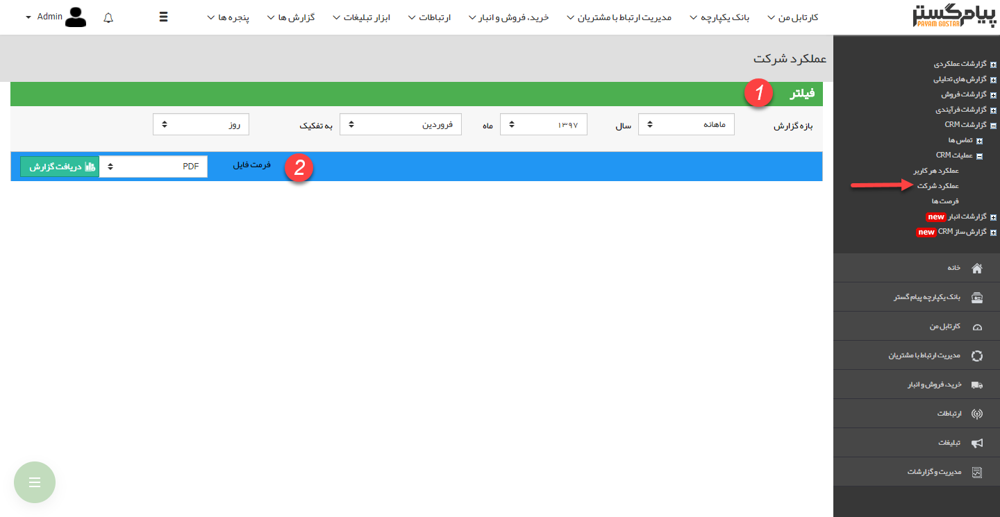
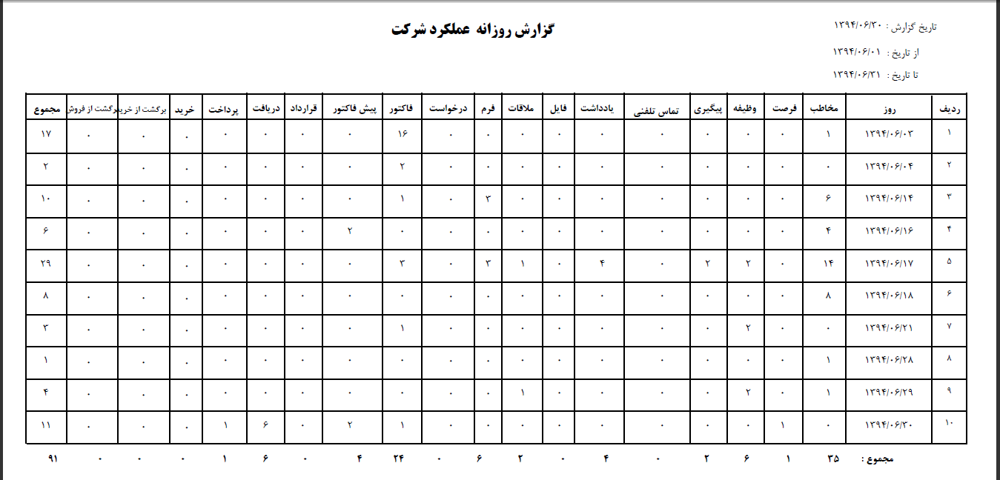

## عملکرد شرکت

این گزارش بر اساس بازه زمانی مشخص شده عملکرد کل شرکت را مشخص می کند. یعنی می توانید گزارش میزان ثبت و ویرایش آیتم های مختلف در نرم افزار را در بازه زمانی مورد نظر خود به تفکیک روز، ماه، فصل یا سال مشاهده نمایید.

برای استفاده از این گزارش علاوه بر مدیر سیستم ، کاربر نیاز  مجوز مدیر فروش یا مدیر پشتیبانی و یا مدیر ارتباط با مشتری دارد .

1. بازه گزارش: در این قسمت می توان بازه زمانی دلخواه جهت گزارش دهی را تعیین نمود. این بازه می تواند بصورت ماهانه، سالیانه و یا یک بازه دلخواه باشد که در فیلد اول قابل انتخاب است. پس از انتخاب بازه مورد نظر خود، نحوه تفکیک ردیف های جدول را در خروجی گزارش مشخص کنید.

2. فرمت فایل:  در قسمت فرمت فایل، نوع فایل خروجی را انتخاب کرده و روی دریافت گزارش کلیک کنید تا گزارش مورد نظر دانلود شود.

