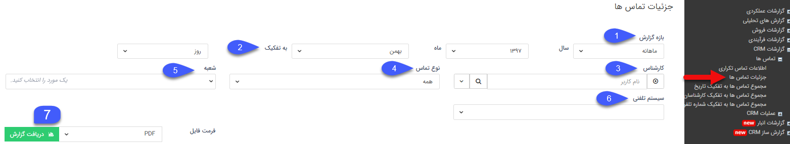
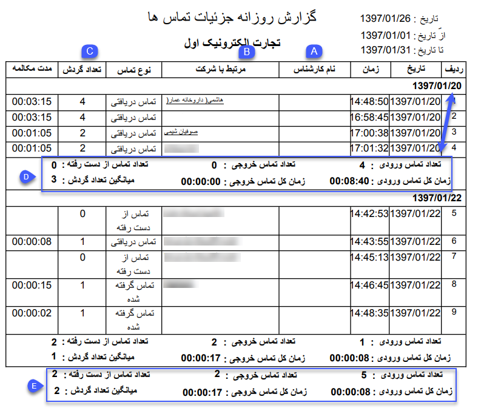

## جزئیات تماس ها

در این قسمت می توانید گزارش تمامی تماس های سیستم تلفنی  تنظیم شده روی نرم افزار را دریافت کنید. برای دریافت گزارش مورد نظر خود می توانید از فیلترهای موجود استفاده کنید.

برای استفاده از این گزارش علاوه بر مدیر سیستم ، کاربر نیاز  مجوز مدیر فروش یا مدیر پشتیبانی و یا مدیر ارتباط با مشتری دارد.

1. بازه گزارش: می توانید بازه تماس های نمایش داده شده در خروجی گزارش را مشخص کنید.

2. به تفکیک: بر اساس بازه گزارش انتخاب شده می توانید نحوه تفکیک (روز، ماه، فصل، سال) نمایش تماس ها در خروجی گزارش را مشخص کنید.  

3. کارشناس: در صورتی که قصد مشاهده جزئیات تماس های یک کارشناس مشخص را دارید می توانید از این فیلتر استفاده کنید. توجه داشته باشید این موضوع نیازمند تعریف شماره داخلی متناظر کاربران سیستم از قسمت مدیریت گروه ها و کاربران یا مدیریت سیستم های تلفنی می باشد.

4. نوع تماس: با استفاده از این فیلتر می توانید نوع تماس های (دریافتی، گرفته شده، از دست رفته) گزارش را مشخص کنید.

5. شعبه: می توانید یکی از شعبه های تعریف شده در قسمت مدیریت شعب، دپارتمان و سمت که سیستم تلفنی مورد نظرتان روی آن تنظیم شده است را انتخاب کنید.

6. سیستم تلفنی: پس از انتخاب شعبه مورد نظر در قسمت قبل می توانید یکی از سیستم تلفنی های تنظیم شده در آن شعبه را جهت نمایش جزئیات تماس مربوطه انتخاب کنید.

7. دریافت گزارش: پس از اعمال فیلترهای مورد نظر، فرمت فایل خروجی گزارش را مشخص کرده و روی دکمه دریافت گزارش کلیک کنید تا جزئیات تماس را در قالب فایل با فرمت دلخواه
خود دریافت کنید.

A. نام کارشناس: در صورتی که شماره داخلی برقرار کننده تماس تلفنی به یک کاربر تخصیص داده شده باشد، می توانید نام کارشناس مربوط به تماس را در این قسمت مشاهده نمایید.

B. مرتبط با: در صورتی که شماره مخاطب تماس در پروفایل یکی از هویت های بانک اطلاعاتی ذخیره شده باشد، می توانید نام و لینک پروفایل هویت مربوطه را در این قسمت مشاهده نمایید.

C. تعداد گردش: در صورتی که تماس مربوطه به شماره یا شماره های داخلی دیگری انتقال داده شده باشد، می توانید تعداد گردش تماس را در این قسمت مشاهده نمایید. توجه کنید تعداد گردش برای تماس های از دست رفته 0، برای تماس های بدون انتقال 1 و برای تماس های دارای انتقال مقدار بیشتر 1 دارد.

D. بر اساس فیلتر نحوه تفکیک گزارش (فیلتر شماره 2) اطلاعات کل تماس های هر روز، ماه، فصل یا سال در این قسمت نمایش داده می شود.

E. اطلاعات کل تماس های بازه زمانی انتخاب شده را می توانید در این قسمت مشاهده نمایید.