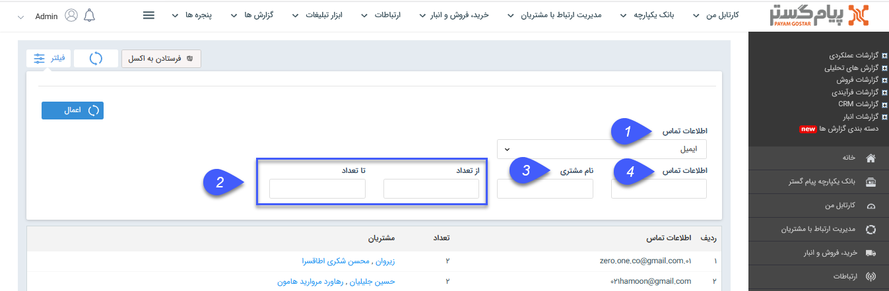

## اطلاعات تماس تکراری

> مسیر دسترسی:  **مدیریت و گزارشات** >**گزارشات crm** > **تماس‌ها** > **اطلاعات تماس تکراری** 

در این قسمت می توانید گزارشی از هویت هایی که اطلاعات تماس تکراری دارند (ایمیل و تلفن و موبایل و فکس و ....) دریافت کنید.

1. در این قسمت انتخاب کنید که بر اساس کدام اطلاعات تماس قصد گزارش گیری دارید.

2. در این قسمت بازه تعداد اطلاعات تکراری مدنظر را انتخاب کنید .

3.  در این قسمت می توان براساس نام هویت مورد نظر فیلتر انجام داد تا مشاهده شود هویت مورد نظر اطلاعات تماسی تکراری با کدام هویت یا هویت های دیگر دارد .

4. می توان براساس تماسی فیلتر انجام داد برای مثال مشاهده شود شماره همراه مد نظر در کدام پروفایل ها موجود است .