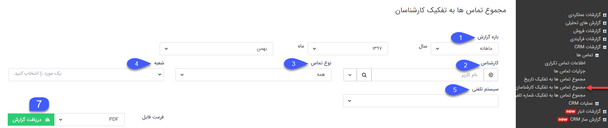
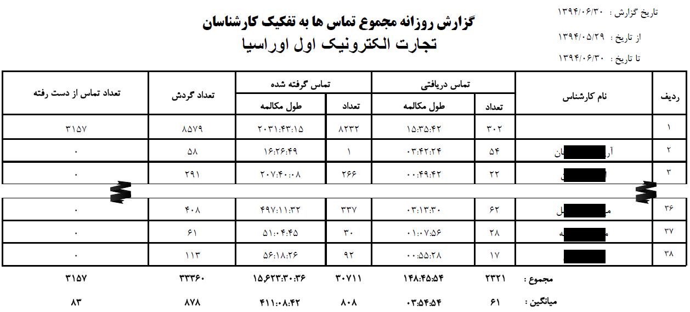

## مجموع تماس ها به تفکیک کارشناسان

> مسیر دسترسی:  **مدیریت و گزارشات** >**گزارشات crm** > **تماس‌ها** > **مجموع تماس‌ها به تفکیک کارشناس** 

در این قسمت می توانید گزارش مجموع تماس ها را به تفکیک کارشناسان نرم افزار دریافت کنید.

نکته: توجه داشته باشید در صورتی که تماس برقرار شده با یکی از شماره های داخلی باشد که به هیچ کاربری اختصاص داده نشده است، گزارش آن تماس در ردیف اول این گزارش لحاظ خواهد شد.

برای استفاده از این گزارش علاوه بر مدیر سیستم ، کاربر نیاز  مجوز مدیر فروش یا مدیر پشتیبانی و یا مدیر ارتباط با مشتری دارد

1. بازه گزارش: می توانید بازه تماس های نمایش داده شده در خروجی گزارش را مشخص کنید.

2. کارشناس: در صورتی که قصد مشاهده اطلاعات تماس های یک کارشناس مشخص را دارید می توانید از این فیلتر استفاده کنید. توجه داشته باشید این موضوع نیازمند تعریف شماره داخلی متناظر کاربران سیستم از قسمت[  مدیریت گروه ها و کاربران ](https://github.com/1stco/PayamGostarDocs/blob/master/help%202.5.4/Settings/Manage-groups-and-users/Manage-groups-and-users.md)یا[مدیریت سیستم های تلفنی ](https://github.com/1stco/PayamGostarDocs/blob/master/help%202.5.4/Basic-Information/Telephone-systems/telephone-systems-Management%2Ftelephone-systems-Management.md)می باشد.

3. نوع تماس:با استفاده از این فیلتر می توانید نوع تماس های (دریافتی، گرفته شده، از دست رفته) گزارش را مشخص کنید.

4. شعبه:می توانید یکی از شعبه های تعریف شده در قسمت مدیریت شعب، دپارتمان و سمت که کال سنتر مورد نظرتان روی آن تنظیم شده است را انتخاب کنید.

5. سیستم تلفنی: پس از انتخاب شعبه مورد نظر در قسمت قبل می توانید یکی از سیستم تلفنی های تنظیم شده در آن شعبه را جهت نمایش اطلاعات تماس مربوطه انتخاب کنید.

6. دریافت گزارش: پس از اعمال فیلترهای مورد نظر، فرمت فایل خروجی گزارش را مشخص کرده و روی دکمه دریافت گزارش کلیک کنید تا اطلاعات تماس را در قالب فایل با فرمت دلخواه خود دریافت کنید

