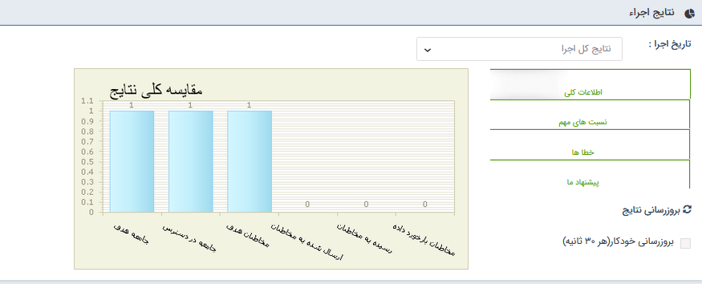

## الف-اطلاعات کلی

ستون اول: جامعه هدف تعیین کننده تمام مخاطبانی است که برای ارسال پیام تبلیغاتی خود، آن ها را انتخاب می کنید.

ستون دوم: منظور از جامعه در دسترس تمام کسانی هستند که می توانند با توجه به ابزار و رسانه ی انتخابی شما، مخاطب پیام تبلیغاتی باشند. در این مثال، چون کاربر از رسانه پیام کوتاه استفاده نموده، از بین 2 مخاطب هدفی که انتخاب شده هردو  2 مخاطب  شماره موبایل داشته  و این تعداد در دسترس می باشند .

ستون سوم: مخاطبان هدف حاصل انتخاب شما از تمام کسانی است که در دسترس هستند. عواملی نظیر بودجه تبلیغات، ارسال در زمان های مختلف، ارسال پیام های متفاوت با محتوای مختلف و یا ارسال پیام به تعدادی از مخاطبان با هدف تبلیغاتی مختلف، می تواند باعث شود کاربر مورد نظر از میان 2 مخاطب که می توانستند مخاطب این برنامه تبلیغاتی باشند، 2 نفر را انتخاب کند.

ستون چهارم: تعداد پیام ارسال شده به مخاطبان را نشان می دهد. منظور از این تعداد، پیام هایی است که از نرم افزار خارج شده و برای ایمیل، تلفن همراه و یا فکس مخاطبان ارسال شده است ( لیست ارسال برای آن ها تشکیل شده است ) . در صورتی که آدرس ایمیل و یا شماره تلفن همراه و فکس مخاطبان اشتباه باشد، ستون چهارم از ستون سوم کمتر خواهد شد.

ستون پنجم: تعداد پیام های رسیده ، در ایمیل معادل پیام هایی است که در صندوق (Inbox) ایمیل مخاطب باز شده و مشاهده شده است. در مورد تلفن همراه و فکس هم این عدد نشانه ی دریافت در دستگاه موبایل و فکس گیرنده پیام است. تعداد پیام های رسیده به دلایلی نظیر این که گیرنده ایمیل متن شما را مطالعه نکند و یا خط فکس اشغال بوده و یا موبایل مخاطب در دسترس نبوده و یا خاموش باشد، ممکن است از تعداد ارسال ها کمتر باشد

ستون ششم: بازخوردها همان عکس العمل مخاطبان پیام های شما هستند. کسانی که به پیام کوتاه شما پاسخ می دهند، و همچنین کسانی که بر روی لینک ویژه هوشمند در متن ایمیل ارسالی شما کلیک می کنند تا به آدرس اینترنتی مورد نظر شما بروند، در این ستون معلوم می شوند. این مثال یک ارسال گروهی ساده است و بازخوردی دریافت نمی کند .

مسئله ای که در اینجا مطرح است این است که در هنگام استفاده از مودم gsm  و همچنین خطوط url  امکان مشاهده وضعیت تحویل وجود ندارد و همیشه وضعیت تحویل نا مشخص نمایش داده می شود به این دلیل ستون رسیده به مخاطب همچنان صفر نمایش داده خواهد شد .