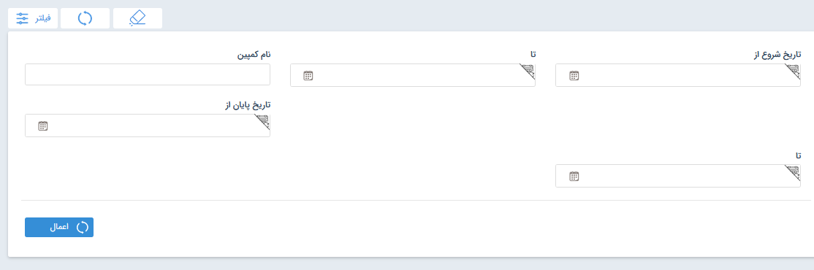
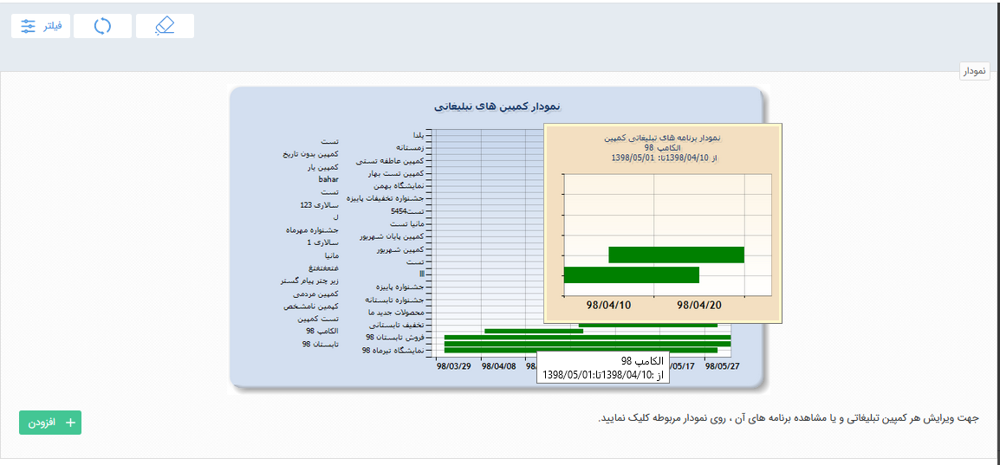
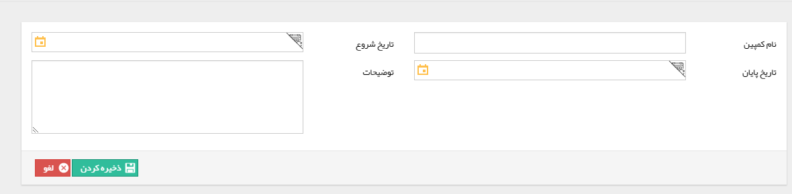
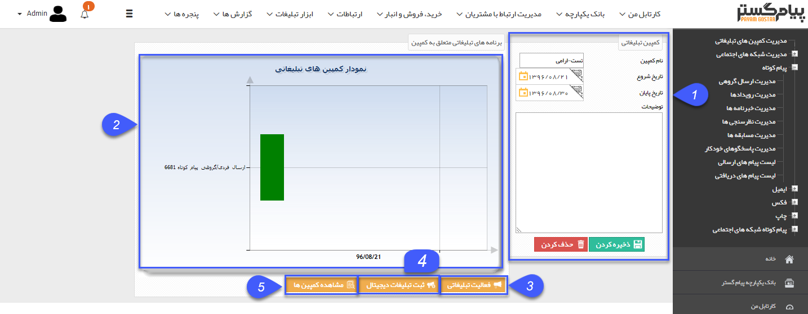
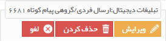
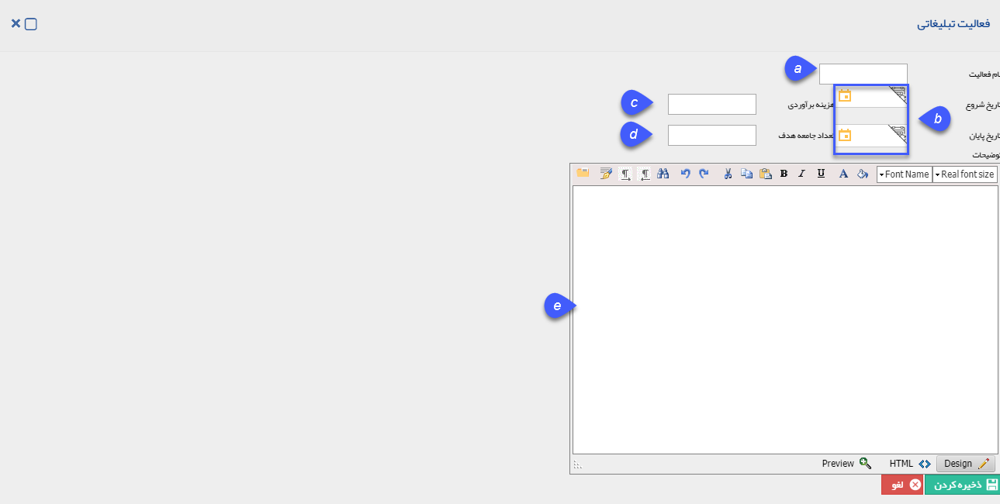
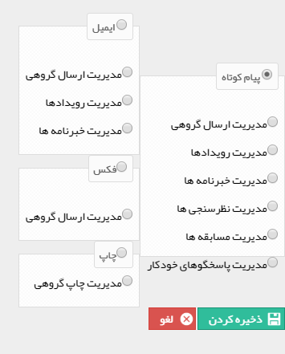

## مدیریت یکپارچه تبلیغاتی(کمپین)

به مجموع هرچیزی در راستای رسیدن به هدفی مشخص کمپین گفته می شود، مانند کمپین مردمی که نشان دهنده اجتماع مردم برای هدف خاصی است. کمپین های تبلیغاتی مجموعه ای تبلیغات دیجیتال و غیر دیجیتال هستند که در راستای تبلیغ و نمایش محصول و یا خدمت خاصی استفاده می شوند.

 کمپین تبلیغاتی برای مدیریت بهتر برنامه های تبلیغاتی  و بررسی بهتر نتایج این برنامه ها در نظر گرفته شده است. می توان در این قسمت تمام کمپین هایی که اجرا شده و یا در حال اجرا هستند را مدیریت نمود و بر اساس تاریخ شروع و پایان  و یا نام کمپین فیلتر نمود.  تمام اطلاعات مربوط به کمپین ، برنامه های تبلیغاتی و دیجیتال تعریف شده برای این کمپین را نمایش می دهد .
 
 
 
 تاریخ شروع از/تا : می توان براساس بازه تاریخ شروع  کمپین ، فیلتر مورد نظر را اعمال کرد .

تاریخ پایان از / تا : می توان براساس بازه تاریخ پایان کمپین ، فیلتر مورد نظر را اعمال کرد .

نام کمپین :  می توان براساس نام کمپین فیلتر مورد نظر را اعمال کرد .

نمودار: با نگه داشتن نشانگر موس، می توانید مشخصات هر کمپین مانند تاریخ شروع و پایان آن ، برنامه های تنظیم شده برای آن کمپین را مشاهده نمایید و در صورت کلیک بر روی کمپین مورد نظر در نمودار، وارد تنظیمات آن کمپین خواهید شد.

اضافه کردن:با کلیک بر روی دکمه اضافه کردن پنجره زیر برای شما باز خواهد شد و می توانید کمپین تبلیغاتی و بازه اجرای آن را تعریف کنید .

> نکته: طبق عکس بالا، با نوشتن نام کمپین و تاریخ شروع و پایان، می توانید یک کمپین تعریف نمایید. فیلد توضیحات جهت شرح اطلاعات اولیه و مورد نیاز درباره کمپین تعبیه شده است.

با دوبار کلیک به روی هر کمپین به صفحه تنظیمات آن کمپین طبق تصویر زیر وارد می شوید.

1. اطلاعات : در این قسمت، اطلاعات کمپین مانند تاریخ شروع و پایان و نام آن را مشاهده میکنید.

2.  نمودار برنامه های تبلیغاتی: برنامه های تبلیغاتی که برای این کمپین تعریف شده است بصورت بازه زمانی در این نمودار نمایش داده می شود. و با کلیک بر روی هرکدام، پنجره ای به شکل زیر جهت تدوین برای شما باز میگردد

1. فعالیت تبلیغاتی: بازدن این دکمه وارد پنجره تعریف برنامه تبلیغاتی غیر دیجیتال خواهید شد.(منظور از  فعالیت اهای غیر دیجیتال، برنامه های تبلیغاتی است که در پیام گستر انجام و ارسال نمی شوند.)

a.نام فعالیت: در این فیلد نام تبلیغات مورد نظر نوشته می شود.

b.تاریخ شروع/پایان: تاریخ شروع تبلیغ و تاریخ پایان در این فیلدها مشخص میگردد.

c.هزینه برآورد:هزینه ای که بابت تبلیغ داده می شود و یا برآورد می شود که باید داده شود را اینجا یادداشت می کنید.

d.تعداد جامعه هدف: تعداد مخاطبانی که بعنوان هدف شما برای این تبلیغ در نظر گرفته می شود ، در این فیلد مشخص می شود.

e.توضیحات: توضیحات مرتبط با تبلیغ کمپین را در این قسمت بنویسید. (مانند نوع ابزار تبلیغ و نحوه کاربری و اجرای تبلیغ)

4. ثبت تبلیغات دیجیتال: با کلیک بر روی این دکمه، امکان انتخاب یکی از روش های تبلیغات در نرم افزار مانند: پیامک، ایمیل، فکس و چاپ می باشد. پس از انتخاب وارد صفحه مدیریت  همان ابزار تبلیغاتی  جهت تنظیم ارسال(که در بخش<a href="file%3A%2F%2F%2FC%3A%5CUsers%5CH.abasi%5CDesktop%5Chelp%5Cmd%20help%5C%D8%AA%D8%A8%D9%84%DB%8C%D8%BA%D8%A7%D8%AA%5Cmoshtarak-abzar%5Cmoshtarak-abzar.md" target="_blank"> اطلاعات مشترک ابزار</a> کامل توضیح داده شده) خواهیم شد.

5. مشاهده کمپین ها:

با استفاده از این کلید به صفحه مدیریت کمپین ها منتقل می شویم .

