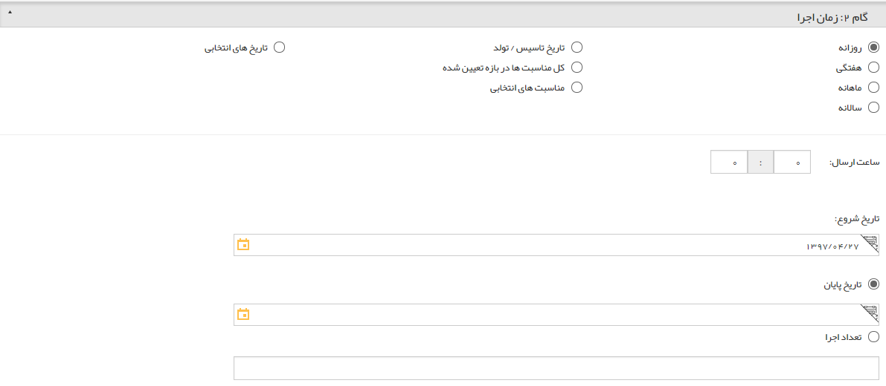

## گام2-زمان اجرا

> مسیر دسترسی:  **تبلیغات** >**ایمیل** > **مدیریت رویدادها** > **ارسال رویداد جدید** > **محتوای پیام رویداد** 

به<a href="file%3A%2F%2F%2FC%3A%5CUsers%5CH.abasi%5CDesktop%5Chelp%5Cmd%20help%5C%D8%AA%D8%A8%D9%84%DB%8C%D8%BA%D8%A7%D8%AA%5Csms%5CAdvertising-event%5C2-zaman-bandi%5Czaman-bandi.md" target="_blank"> گام 2- زمان بندی اجرا </a>در رویداد تبلیغاتی پیام کوتاه مراجعه کنید.

