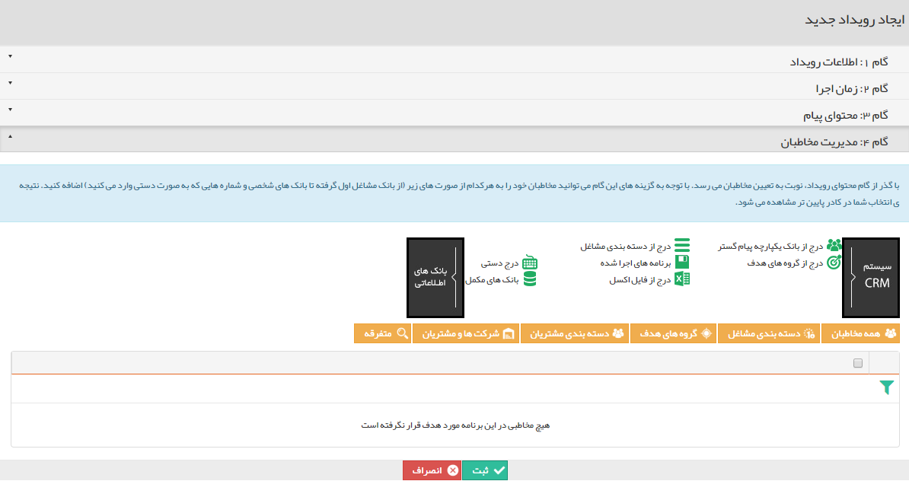

## گام4-انتخاب مخاطبان

> مسیر دسترسی:  **تبلیغات** >**ایمیل** > **مدیریت رویدادها** > **ارسال رویداد جدید** > **مدیریت مخاطبان** 

برای اطلاعات بیشتر به لینک [انتخاب مخاطبان ](file:///C:\Users\h.abasi\Documents\GitHub\PayamGostarDocs\help%202.5.4\Marketing\moshtarak-abzar\gam%20se\select-Audience.md)در برنامه پیام کوتاه مراجعه نمایید.

این مخاطبان باید شامل پروفایل هایی باشند که آدرس ایمیل در آن ها وجود داشته باشد .

