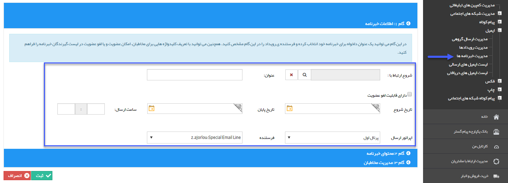

## گام1-اطلاعات خبرنامه

> مسیر دسترسی:  **تبلیغات** >**ایمیل** > **مدیریت خبرنامه‌ها** > **ارسال خبرنامه جدید** > **اطلاعات خبرنامه** 

لطفا ابتدا[ اطلاعات مشترک ابزارها ](file:///C:\Users\h.abasi\Documents\GitHub\PayamGostarDocs\help%202.5.4\Marketing\moshtarak-abzar\gam%20se\select-Audience.md)را مطالعه فرمایید و طبق گام های زیر برای ارسال گروهی جدید اقدام فرمایید

نکته:تنها تفاوت موجود با پیام کوتاه در این است که در ایمیل امکان عضویت خودکار موجود نیست.

