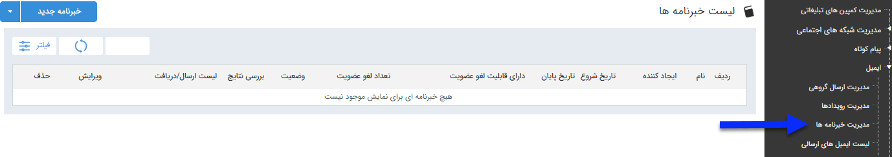

## خبرنامه 

> مسیر دسترسی:  **تبلیغات** >**ایمیل** > **مدیریت خبرنامه‌ها** 

با استفاده از این قابلیت این امکان فراهم می شود تا در تاریخ های مورد نظر پیام های  هوشمند مختلفی را برای مخاطبان خود ارسال کنید .

در صفحه اول، می توان با تعیین تاریخ اجرا، کاربر ایجاد کننده برنامه،نام برنامه تعریف شده و براساس قابلیت عضویت و لغو عضویت و زدن دکمه فیلتر، لیست برنامه های اجرا شده در گذشته را مشاهده کرد. اما برای اجرای یک برنامه جدید باید بر روی دکمه "خبرنامه جدید" در سمت راست و بالای صفحه کلیک کرده و بالای صفحه کلیک کرده و با گذراندن چند گام ساده، برنامه را به راحتی اجرا نمایید.

لطفا ابتدا  <a href="file%3A%2F%2F%2FC%3A%5CUsers%5CH.abasi%5CDesktop%5Chelp%5Cmd%20help%5C%D8%AA%D8%A8%D9%84%DB%8C%D8%BA%D8%A7%D8%AA%5Cmoshtarak-abzar%5Cmoshtarak-abzar.md" target="_blank"> اطلاعات مشترک ابزارها </a>را مطالعه فرمایید و طبق گام های زیر برای ارسال گروهی جدید اقدام فرمایید

<a href="1-avalie-khabarname-email%2F1-avalie-khabarname-email.md" target="_blank">گام1-اطلاعات اولیه خبرنامه</a>

گ<a href="2-tanzimmatn-khabarname-email%2F2-tanzimmatn-khabarname-email.md" target="_blank">ام2- محتوای خبرنامه</a>

<a href="3-mokhatab-khabarname-email%2F3-mokhatab-khabarname-email.md" target="_blank">گام3-انتخاب مخاطبان</a>

