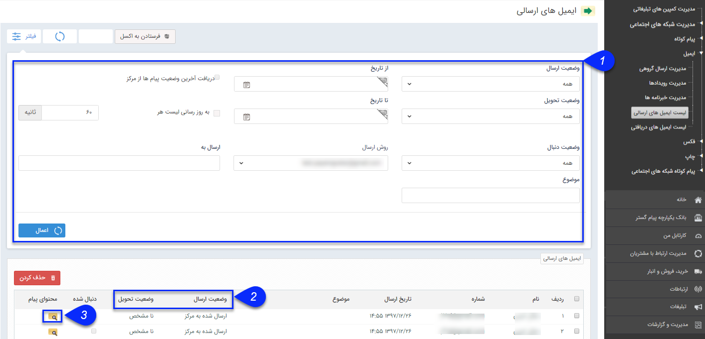

## لیست ایمیل ‌های ارسالی

 از طریق این صفحه می توانید  تمام ایمیل های ارسالی خود را مشاهده کنید. تاریخ ارسال، روش ارسال، وضعیت ارسال، وضعیت تحویل و وضعیت دنبال فاکتورهایی هستند که می توانید بر اساس آن ها لیست ایمیل ها را محدود نمایید.

> نکته: برای اطلاعات بیشتر در خصوص لیست ارسال ها به قسمت<a href="file%3A%2F%2F%2FC%3A%5CUsers%5CH.abasi%5CDesktop%5Chelp%5Cmd%20help%5C%D8%AA%D8%A8%D9%84%DB%8C%D8%BA%D8%A7%D8%AA%5Cmoshtarak-abzar%5Cmoshtarak-abzar.md" target="_blank"> اطلاعات مشترک لیست ارسال</a> پیام مراجعه کنید.

1. درقسمت فیلتر ها، با توجه فیلدهای مشخص شده می توانید می توانید، دامنه نمایش ایمیل ها را محدود کنید.

2. وضعیت ارسال و وضعیت تحویل می توانند به شما در نتیجه ایمیل های ارسالی کمک نمایند .

3. در ستون محتوای پیام، می توانید، متن پیام ارسالی خودر را ببینید.

