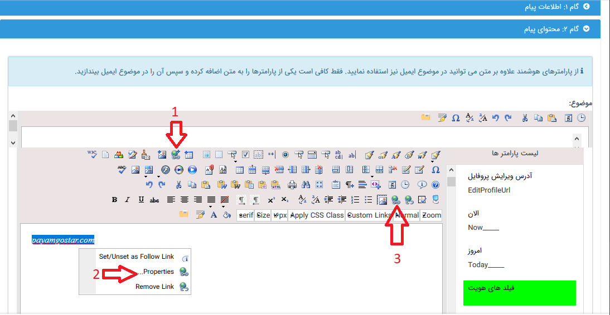

## ایمیل ویژه-هوشمند

ایمیل ویژه برای دنبال کردن عکس العمل مخاطب شماست. آگاهی از تاثیر پیام شما بر مخاطب می تواند در بهبود تبلیغات شما تاثیر بسزایی داشته باشد. با انتخاب این  اپراتور ،  ارسال ها دارای تضمین Inbox  هستند و پس از ارسال موفق یا ناموفق بودن ارسال و همچنین باز شدن و یا نشدن ایمیل توسط مخاطب را به کاربر نمایش می دهد.

نکته جالب توجه در ارسال ایمیل ویژه، قراردادن لینک ویژه است. می توان در قسمت تنظیم متن لینکی قرارداد و با کلیک راست بر روی آن و انتخاب لینک ویژه، این لینک را قابل ردگیری کرد. به این شکل که اگر دریافت کننده ایمیل بر روی لینک کلیک نمایید در نمودار در ستون مخاطبان بازخورده نمایش داده می شود.

1. با استفاده از این گزینه می توانید یک لینک به ایمیل خود اضافه کنید(مانند HTTP://PAYAMGOSTAR.COM)

2. با راست کلیک بر روی یک لینک می توانید آن را به صورت ویژه تعیین کنید. در گزارشات مربوط به این ارسال تعداد مخاطبانی که بر روی این لینک کلیک کرده اند را نیز می توان مشاهده کرد.

3. با استفاده از این گزینه هم می شود لینک ویژه ایجاد کرد و یا لینک ایجاد شده را به لینک ویژه تبدیل کرد.

> نکته: در صورتی که می خواهید از SMTP   برای ارسال ایمیل استفاده نمایید ایمیل شما قابلیت ردگیری نخواهد داشت.

