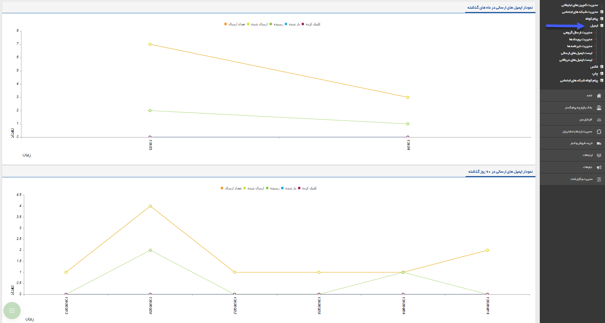

## ایمیل 

در این بخش امکان مشاهده گزارش از ارسال ایمیل ها، بصورت نموداری می باشد که شامل دو نمودار می باشد :

نمودار پیام کوتاه های ارسالی در ماه های گذشته :  بصورت خودکار سه ماه گذشته نمایش داده می شود ، که در هر کدام از این ماه ها چه تعداد ایمیل ارسال شده، چه تعداد رسیده ، چه تعداد از ایمیل ها توسط مخاطب باز شده و چه تعداد از ایمیل ها را که شامل لینک بوده روی لینک کلیک شده است  .

نمودار پیام کوتاه های ارسالی در 90 روز گذشته:  در این قسمت گزارش نموداری ارسال پیام ها در 90 روز گذشته نمایش داده می شود ، چه تعداد رسیده ، چه تعداد از ایمیل ها توسط مخاطب باز شده و چه تعداد از ایمیل ها را که شامل لینک بوده روی لینک کلیک شده است 

> نکته : کاربر برای استفاده از برنامه های تبلیغاتی مربوط به ایمیل نیاز به مجوز ارسال ایمیل دارد .

<a href="Send-operators%2FSend-operators.md" target="_blank">اپراتور ارسال</a>

<a href="Email-sender%2FEmail-sender.md" target="_blank">فرستنده ایمیل</a>

<a href="Smart-email%2Fsmart-email.md" target="_blank">ایمیل ویژه-هوشمند</a>

<a href="Photo-email%2FPhoto-email.md" target="_blank">طریقه ایجاد یک ایمیل عکس دار</a>

<a href="send-group-email%2Fsend-group-email.md" target="_blank">مدیریت ارسال گروه</a>

<a href="Advertising-event-email%2Fadvertising-event-email.md" target="_blank">رویداد تبلیغاتی</a>

<a href="Newsletters-email%2FNewsletters-email.md" target="_blank">خبرنامه</a>

<a href="Send-List-email%2Fsend-list.-email.md" target="_blank">لیست ایمیل های ارسالی</a>

<a href="resive-list-email%2Fresive-list-email.md" target="_blank">لیست ایمیل های دریافتی</a>
