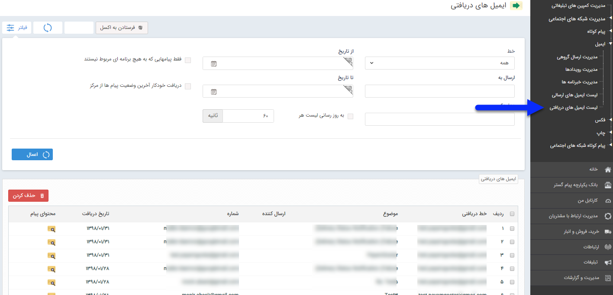

## لیست پیام های دریافتی

در این پنجره تمام ایمیل هایی که پس از اجرای برنامه های مختلف به شماره شما ارسال شده است، نمایش داده می شود. شماره خط و ارسال کننده و همچنین تاریخ دریافت نمایش داده می شود. همچنین می توان لیست ایمیل ها را با فاکتورهایی مانند تاریخ دریافت و یا بازه ای بین دو تاریخ محدود نمود.

برای دیدن متن ارسال شده بر روی لینک محتوای پیام  در روبروی هر سطر کلیک نمایید.

