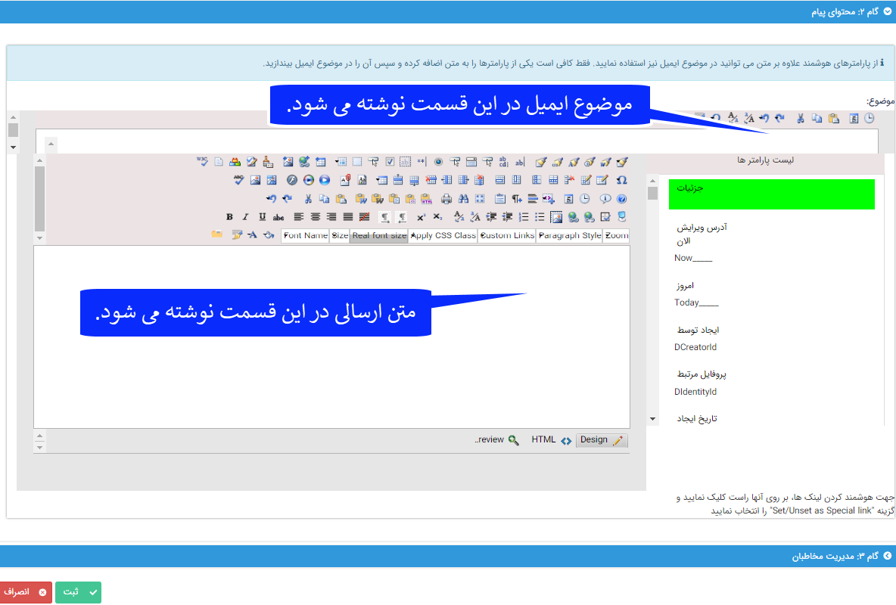

## گام2-تنظیم متن

> مسیر دسترسی:  **تبلیغات** >**ایمیل** > **مدیریت ارسال گروهی** > **ارسال گروهی جدید** > **محتوای پیام ارسال گروهی** 

در این گام می توانید متن مورد نظر برای ارسال را وارد و ویرایش کنید . از طریق منوی بالای صفحه (که شامل فایل، قالب و راهنمایی متن هوشمند می شود)، می توانید متون مورد نظر خود را که قبلا نوشته و در سیستم کامپیوتر خود ذخیره نموده اید وارد کنید، یا از قالب هایی که برای راحتی کار شما در نظر گرفته شده، استفاده کنید. همچنین امکان استفاده از متن هوشمند (به عنوان یکی از ویژگی های خاص پیام گستر) در این گام برای شما فراهم شده است

لطفا ابتدا<a href="C%3A%2FUsers%2FH.abasi%2FDesktop%2Fhelp%2Fmd%20help%2F%D8%AA%D8%A8%D9%84%DB%8C%D8%BA%D8%A7%D8%AA%2Fmoshtarak-abzar%2Fmoshtarak-abzar.md" target="_blank"> گام دوم - محتوای پیام </a>در اطلاعات مشترک ابزارها را مطالعه کنید.

1. قرار دادن تصویر در متن: به قسمت طریقه <a href="file%3A%2F%2F%2FC%3A%5CUsers%5CH.abasi%5CDesktop%5Chelp%5Cmd%20help%5C%D8%AA%D8%A8%D9%84%DB%8C%D8%BA%D8%A7%D8%AA%5Cemail%5CPhoto-email%5CPhoto-email.md" target="_blank">ایجاد یک ایمیل عکس دار </a>مراجعه کنید.

2. لینک آدرس اینترنتی: استفاده از قابلیت لینک، در هر قسمت از متن که بخواهید می توانید یک آدرس اینترنتی را با کلیک بر آیکون InsertLink در بالای کادر متن به صورت لینک درآورید .کافی است URL مربوط به آن را در کادر آن وارد نمایید.

3. به قسمت <a href="file%3A%2F%2F%2FC%3A%5CUsers%5CH.abasi%5CDesktop%5Chelp%5Cmd%20help%5C%D8%AA%D8%A8%D9%84%DB%8C%D8%BA%D8%A7%D8%AA%5Cemail%5CSmart-email%5Csmart-email.md" target="_blank">ایمیل ویژه-هوشمند </a>مراجعه کنید.

