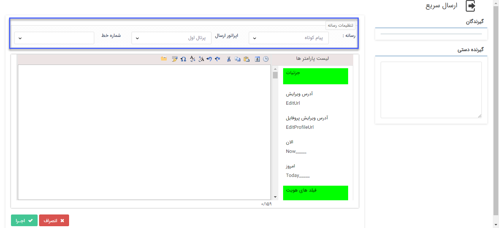

## ارسال سریع پیام

> مسیر دسترسی:  **خانه** >**ویجت دسترسی سریع** > **ارسال سریع** 

از طریق ویجت دسترسی سریع امکان ارسال پیام بصورت تکی و چندتایی وجود دارد.

**تنظیمات رسانه:**
در این بخش باید ابزار(پیامک،ایمیل، فکس و چاپ) و خط موردنظر برای ارسال پیام انتخاب شود. 

**گیرنده دستی:**
شماره تلفن، ایمیل و شماره فکس باید در این بخش تعریف شود و با هر بار   ENTER می‌توان گیرنده‌ی دیگری را اضافه کرد. 

در انتها با تعریف متن ارسالی و انتخاب کلید اجرا ارسال برای گیرنده/گیرندگان انجام می‌شود.

