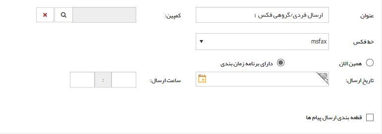

## گام1-اطلاعات اولیه پیام

> مسیر دسترسی:  **تبلیغات** >**فکس** > **مدیریت ارسال گروهی فکس** > **ارسال گروهی جدید** > **اطلاعات ارسال گروهی فکس** 

به گام اول - اطلاعات پیام در[ اطلاعات مشترک ابزارها ](https://github.com/1stco/PayamGostarDocs/blob/master/help%202.5.4/Marketing/moshtarak-abzar/gam%20yk/gam-yk.md)مراجعه کنید

